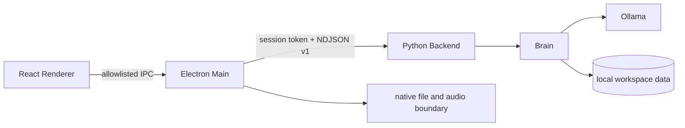

<p align="center">
  
</p>

<h1 align="center">Elysia AI</h1>

<p align="center">
  <strong>English</strong> | <a href="./README.md">中文</a>
</p>

<p align="center">
  <a href="https://github.com/ActorF/Elysia_AI/actions/workflows/tests.yml"></a>
</p>

**Elysia AI is a Windows-focused, local-first AI companion centered on Elysia.**

> The Python Core owns Chats, Projects, Memory, recovery, and local Ollama inference.<br>
> The React + Electron desktop connects to Python through an authenticated, versioned local protocol.<br>
> Character-driven conversation is preserved while user data, hardware permissions, and file access remain behind explicit boundaries.

> [!IMPORTANT]
>
> This project is currently a **development preview**, not a ready-to-install release. The desktop shell still depends on the source checkout, its Python environment, Ollama, and a local model. STT, TTS, continuous voice, RAG, the Work Agent, Live2D, and production installation are not complete.

---

## ✨ At a Glance

- 💬 **Local Text Chat** — Streams responses from a local Ollama model and atomically saves complete conversation turns
- 🗂️ **Multiple Chat Histories** — Create, open, rename, pin, archive, restore, delete, stop, and retry Chats
- 📁 **Project Workspaces** — Store Instructions, bind a Workspace, archive Projects, and manage Chat assignment between Projects and the unassigned area
- 🧠 **Scoped Memory** — Keeps Global, Project, and Chat boundaries distinct, with long-term memory, summaries, and confirmation flows
- 🛡️ **Strict Desktop Boundary** — Sandboxed Renderer, narrow Preload API, origin checks, and authenticated NDJSON Protocol v1
- 📎 **Safe Attachment Surface** — Select, drop, preview, remove, and recover Chat or Project files; content is not parsed or indexed yet
- 🎙️ **Local Audio Foundation** — Device selection, permission state, and short hardware tests are available; one-utterance PCM/VAD capture remains experimental
- 💾 **Recovery First** — Local JSON storage, legacy migration, quarantine, atomic writes, and import/export services
- ♿ **Desktop Usability** — Themes, keyboard navigation, focus management, Windows scaling, Chinese IME, and offline/error recovery

---

## 📊 Current Status

| Capability | Status | Current boundary |
| --- | :---: | --- |
| Local text Chat | ✅ Available | Ollama streaming, atomic persistence, Stop, and Retry |
| Chat History | ✅ Available | Multiple sessions, pin, archive, restore, delete, and per-Chat drafts |
| Project | ✅ Available | Metadata, Instructions, Workspace binding, and Chat ownership |
| Memory Core | ✅ Available | Global / Project / Chat scopes, retrieval, summaries, and long-term memory foundation |
| Settings | ✅ Available | Model, Ollama origin, Memory limits, file size, and theme |
| Attachments / Sources | ✅ Foundation available | Safe storage and metadata only; no content reading, parsing, Embedding, or RAG |
| Audio Devices | ✅ Available | Microphone/speaker selection, Windows permission state, input level, and output tone tests |
| One-utterance recording and local VAD | 🚧 In development | Explicit start, 16 kHz mono `s16le`, transient validation; no Chat Turn |
| STT / Faster-Whisper | ⏳ Planned | Audio is not converted to text yet |
| GPT-SoVITS / TTS | ⏳ Planned | Local weights are not connected to runtime code |
| Continuous voice and barge-in | ⏳ Planned | No complete `LISTENING → THINKING → SPEAKING` session yet |
| File parsing and local RAG | ⏳ Planned | No Loaders, Chunking, Vector Store, or cited answers |
| Work Agent and tool permissions | ⏳ Planned | No tool execution, desktop control, Internet, or Vision workflow |
| Live2D / desktop pet | ⏳ Planned | The application currently has UI and a character placeholder only |
| Standalone installation and updates | ⏳ Planned | Current packages do not bundle Python, Ollama, or models and are unsigned |

`✅ Available` means the core flow is implemented. `🚧 In development` means code is undergoing integration or acceptance testing and should not be treated as stable. `⏳ Planned` means an entry may already appear in the UI or roadmap while the backing service remains incomplete.

---

## 🧭 Architecture and Trust Boundaries



- **Python is the application source of truth**: Chat, Project, Memory, attachment state, and persistence are managed through Python domain/service/repository boundaries.
- **Electron is the trusted desktop boundary**: it owns the Python child process, native file selection, hardware permissions, and window lifecycle.
- **React remains sandboxed**: `contextIsolation: true`, `nodeIntegration: false`, and `sandbox: true`; the Renderer cannot directly read Node, Python, Chat, Memory, or native source paths.
- **Both sides validate the protocol**: TypeScript and Python consume matching JSON Schema/fixture constraints and negotiate the version, capabilities, and a random session token before use.
- **Local data is recoverable**: important JSON uses strict schemas, revisions, atomic replacement, and corruption quarantine; cancellation does not save an incomplete formal reply.
- **Side effects require an explicit action**: opening Voice does not request microphone access, selecting an attachment does not parse it, and binding a Project Workspace does not execute tools.

See the [Desktop development guide](./desktop/README.md), [Protocol v1](./desktop_protocol/README.md), and [Electron shell decision](./docs/decisions/0001-desktop-shell.md) for implementation details.

---

## 🚀 Quick Start

### Prerequisites

- **Windows 10 / 11 64-bit** (primary development and test platform)
- **Python 3.14**
- **Node.js 24** and npm
- **[Ollama](https://ollama.com/)**
- Git

> [!NOTE]
>
> Every Windows command below is written for **CMD / Command Prompt**. You do not need to change the PowerShell Execution Policy.

### 1. Clone the Repository

```bat
git clone https://github.com/ActorF/Elysia_AI.git
cd /d Elysia_AI
```

### 2. Create the Python Environment

```bat
py -3.14 -m venv .venv
.venv\Scripts\python.exe -m pip install --upgrade pip
.venv\Scripts\python.exe -m pip install -r requirements.txt
```

### 3. Prepare a Local Model

The default model is `qwen3.5:9b`:

```bat
ollama pull qwen3.5:9b
```

Before starting the desktop, make sure Ollama is running and `http://localhost:11434` is reachable. Ollama manages its model weights locally; they are not supplied by this repository.

### 4. Install Desktop Dependencies

```bat
cd desktop
npm ci
cd ..
```

### 5. Start the Desktop

Desktop development mode requires two CMD windows.

Start the Vite Renderer in the first window:

```bat
cd /d D:\Elysia_AI\desktop
npm run dev
```

Start Electron in the second window:

```bat
cd /d D:\Elysia_AI\desktop
npm run electron:dev
```

Electron derives `.venv\Scripts\python.exe` and `desktop_backend.py` from the project root and cleans up that child when the app exits. If your checkout is not at `D:\Elysia_AI`, replace the working directory in each of the two startup commands with its actual location.

### Optional: Start the Console

```bat
cd /d D:\Elysia_AI
.venv\Scripts\python.exe start.py
```

The Console and Electron Desktop are separate entry points and do not need to run together.

---

## ⚙️ Configuration

The root `.env` file is optional. Safe defaults exist when no file is present:

```dotenv
MODEL_NAME=qwen3.5:9b
OLLAMA_HOST=http://localhost:11434
SHORT_TERM_MEMORY_TOKEN_BUDGET=2048
MEMORY_RETRIEVAL_LIMIT=5
DATA_IMPORT_MAX_BYTES=16777216
LOG_LEVEL=INFO
DEBUG=False
```

Desktop **Settings** can update the model, Ollama origin, Memory limits, and file import size. These public values use an independent revision and are written to `workspace/settings/global.json`. Theme selection remains in this device's Renderer Storage.

The current application connects only to local Ollama and does not require a cloud API key. Never commit future secrets, tokens, or private configuration.

---

## 🔍 Feature Details

### 💬 Chat and Message Reliability

- Assistant replies use safe GFM rendering while User messages remain plain text.
- Code blocks, copy, streaming status, Stop, Regenerate, and Edit and retry are supported.
- Drafts are stored per Chat on this device. A Renderer refresh restores drafts and can reattach to a generation request still owned by Electron.
- Chat and Project mutations pass through Python services. The Renderer does not generate persisted IDs or modify indexes directly.

### 📁 Projects and Attachments

- A Project can store a name, Instructions, an optional model, a Workspace binding, and archive state.
- Chats can move between Projects and the unassigned area.
- Filesystem paths from native file selection and drag-and-drop remain inside the trusted Preload/Electron boundary. React receives only opaque IDs, safe filenames, media types, and sizes.
- Sources/Attachments currently provide local storage and lifecycle handling only. They do not read content or feed a RAG pipeline.

### 🧠 Memory and Recovery

- Memory supports Global, Project, and Chat scopes and retrieves only the scopes allowed for the active Chat.
- The Core includes Profile, recent conversation, long-term memory, summaries, memory-candidate confirmation, search, edit, delete, and export foundations.
- Python includes validated import/export for Chats, Projects, and all user data, legacy conversation migration, and corruption quarantine. The matching desktop management UI is not complete.

### 🎙️ Voice

- Microphone/speaker enumeration, saved device preferences, Windows microphone permission state, short input-level tests, and output-tone tests are implemented.
- Experimental one-utterance capture starts only after **Start microphone** is pressed. The Renderer performs local downmixing, resampling, and bounded VAD.
- A valid segment uses 16 kHz mono signed 16-bit little-endian PCM. Python returns only safe receipt data such as format, duration, and SHA-256.
- The current slice does not persist recordings, invoke the Brain, create a Chat message, perform STT, or perform TTS.
- Optional local GPT-SoVITS weights are not connected yet. See [MODEL_LICENSE.md](./MODEL_LICENSE.md) for provenance and restrictions.

---

## 🧪 Development and Verification

### Python

```bat
cd /d D:\Elysia_AI
.venv\Scripts\python.exe -m pytest -q
.venv\Scripts\python.exe -m mypy agent attachments chats config core desktop_protocol memory projects recovery tools ui voice desktop_backend.py start.py
```

### Desktop

```bat
cd /d D:\Elysia_AI\desktop
npm run lint
npm run typecheck
npm run test:contract
npm run test:ui
npm run build
npm audit --audit-level=high
```

`npm test` runs the shared protocol suite followed by the Electron Renderer UI suite. GitHub Actions runs Python and Desktop checks on Ubuntu and an additional native attachment bridge test on Windows.

### Local Packaging Smoke Test

```bat
cd /d D:\Elysia_AI\desktop
npm run package
```

The unpacked output is written to `desktop\out\win-unpacked`. `npm run make` can generate an unsigned NSIS installer, but the current artifact does not include Python, Ollama, or models and is not a standalone release.

---

## 🧱 Technology Stack

| Layer | Technologies |
| --- | --- |
| AI Runtime | Ollama + `langchain-ollama` |
| Python Core | Python 3.14, typed domain/service/repository boundaries |
| Desktop Runtime | Node.js 24 + Electron 43 |
| Renderer | React 19 + TypeScript 6 + Vite 8 |
| Local Protocol | authenticated NDJSON Protocol v1 + JSON Schema |
| Persistence | revisioned/atomic local JSON under `workspace/` |
| Python Quality | pytest 9 + mypy 2 |
| Desktop Quality | ESLint 10 + Playwright 1.62 + TypeScript compiler |
| Packaging | electron-builder + unsigned NSIS development artifact |

---

## 📦 Project Structure

```text
Elysia_AI/
├── attachments/        # Scope-isolated local attachments for Chats and Projects
├── chats/              # Chat domain, serialization, repositories, and migration
├── config/             # Environment defaults and persisted desktop settings
├── core/               # Brain, Ollama adapter, prompts, and active conversations
├── data/characters/    # Character reference corpus; outside source-code licensing
├── desktop/
│   ├── electron/       # Electron Main, Preload, protocol, and native boundaries
│   ├── src/            # React Renderer
│   └── tests/          # Protocol and real Electron UI tests
├── desktop_protocol/   # Shared schema, fixtures, and Python/TypeScript validators
├── memory/             # Profile, summaries, long-term memory, and scopes
├── models/             # Python namespace; local model weight directories are ignored
├── projects/           # Project domain, repositories, and Chat relationship service
├── recovery/           # Import, export, migration, and corruption quarantine
├── tests/              # Python tests
├── voice/              # Audio-device settings and bounded PCM validation foundation
├── workspace/          # Ignored runtime user data; do not remove during source cleanup
├── desktop_backend.py  # Electron-to-Python process entry point
└── start.py            # Console entry point and composition root
```

`logs/`, `.env`, `.venv/`, `workspace/`, Ollama blobs/manifests, and `models/weights/` are ignored by Git.

---

## ❓ FAQ

### Why does CMD remain in `C:\Windows\System32` after `cd D:\Elysia_AI\desktop`?

CMD does not switch drives with plain `cd`. Use:

```bat
cd /d D:\Elysia_AI\desktop
```

### What if PowerShell says `npm.ps1 cannot be loaded`?

Run the `npm` commands from CMD as shown in this README. You do not need to relax the machine's PowerShell Execution Policy for this project.

### Why does the desktop show `Connection error` or wait for the Backend?

Confirm that:

1. Vite and Electron are running in separate CMD windows.
2. `.venv\Scripts\python.exe` exists and dependencies are installed.
3. Ollama is running and the configured Settings origin is reachable.
4. The configured model has been installed with `ollama pull <model>`.
5. `logs\app.log` and the Electron terminal show no new startup error.

### Why does the Voice page not transcribe or reply?

That is the current boundary. Device tests and one-utterance capture validate permissions, PCM, and VAD lifecycle only. STT, TTS, continuous calls, and Voice-created Chat Turns are not implemented.

### Why can Project Sources not answer from file contents?

Files are currently stored safely and represented by metadata only. Loaders, Chunking, Embeddings, a Vector Store, retrieval, and cited answers remain planned work.

---

## 🔐 Local Data and Privacy

- Chats, Projects, Memory, Attachments, Settings, and migration state are stored under `workspace/`.
- `workspace/` and `logs/` are excluded from Git. Treat both as private and do not include them in public diagnostic archives.
- `.env` is ignored by Git but should still stay outside untrusted synchronization locations.
- Original attachment filesystem paths are not returned to React. Public attachment state contains only minimal safe metadata.
- Audio tests do not retain recordings. Experimental PCM exists only for the transient validation lifecycle and does not enter Chat or Memory.
- Do not remove `workspace/` while cleaning source or build output. Use validated Recovery Service exports when moving data.

---

## ⚠️ Model, Character, and Asset Notice

Local GPT-SoVITS weights, reference audio, Ollama models, and caches are not Elysia AI source code; the current Git index and package file lists do not include them. See [MODEL_LICENSE.md](./MODEL_LICENSE.md) for provenance, restrictions, and facts still requiring verification.

In particular, the local model-pack note does not provide complete, verifiable redistribution permission. Do not commit the weights or reference audio, upload them to a Release, or include them in an installer.

`data/characters/elysia_character_reference_zh.md` is already tracked, while its quotations and voice transcriptions have not received item-level provenance and permission review. This is a current repository-distribution risk rather than something to defer until a formal release; [MODEL_LICENSE.md](./MODEL_LICENSE.md) records the details and recommended actions.

---

## ⚖️ Disclaimer and License Status

Elysia AI is an unofficial fan-development project and is **not affiliated with, endorsed by, sponsored by, or partnered with HoYoverse / miHoYo**. *Honkai Impact 3rd*, Elysia, and the related characters, story, artwork, voices, performances, names, and trademarks belong to their respective rights holders. This project does not and cannot grant rights to that third-party material.

Review the current [HoYoverse fan-made content help article](https://support.hoyoverse.com/hc/en-us/articles/51005649400729-What-are-the-guidelines-for-creating-and-selling-fan-made-content) and the [Honkai Impact 3rd material usage and fanwork guidelines](https://www.hoyolab.com/article/1463874) for your region and intended use. The latter expressly states that it does not apply to the Simplified Chinese edition released in mainland China and must not be treated as a universal authorization.

This repository currently has **no root source-code `LICENSE` file**. Repository visibility or clone access therefore does not grant a general right to copy, modify, redistribute, or commercially use the source. If the owner later chooses a software license, it should be added as a separate `LICENSE` and expressly exclude character IP, character corpora, model weights, reference audio, and other third-party assets.

This section and [MODEL_LICENSE.md](./MODEL_LICENSE.md) are factual boundary notices, not legal advice and not a substitute for permission from the relevant rights holders.

---

## 🙏 Acknowledgements

- **Elysia / Honkai Impact 3rd**: © HoYoverse / miHoYo
- **Local Elysia GPT-SoVITS v2 model pack**: the included note identifies `TinyLight微光小明` as model publisher and `花儿不哭` as integration-pack provider
- **Character voice performance**: the local note identifies the CV as Yan Ning (宴宁); related voice and performance rights do not belong to this project
- **GPT-SoVITS**: [RVC-Boss/GPT-SoVITS](https://github.com/RVC-Boss/GPT-SoVITS)
- **Core toolchain**: Ollama, Python, Electron, React, TypeScript, Vite, Playwright, pytest, and mypy

If any provenance, credit, or rights statement is incorrect, please request a correction through a GitHub Issue or the repository maintainer. Until a fact is verified, the relevant asset should remain local and undistributed.

---

## 💌 Contributing

Issues and pull requests about code, tests, documentation, and accessibility are welcome. Do not submit model weights, game voice clips, runtime user data, logs, `.env`, or any asset whose redistribution rights cannot be demonstrated.
