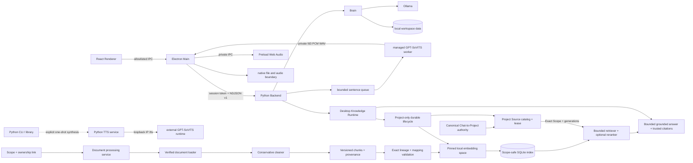

<p align="center">
  
</p>

<h1 align="center">Elysia AI</h1>

<p align="center">
  <strong>English</strong> | <a href="./README.md">中文</a>
</p>

<p align="center">
  <a href="https://github.com/ActorF/Elysia_AI/actions/workflows/tests.yml"></a>
</p>

**Elysia AI is a Windows-focused, local-first AI companion centered on Elysia.**

> The Python Core owns Chats, Projects, Memory, recovery, and local Ollama inference.<br>
> The React + Electron desktop connects to Python through an authenticated, versioned local protocol.<br>
> Character-driven conversation is preserved while user data, hardware permissions, and file access remain behind explicit boundaries.

> [!IMPORTANT]
>
> This project is currently a **development preview**, not a ready-to-install release. The desktop shell still depends on the source checkout, its Python environment, Ollama, and local models. Project Source management, local document answers with trusted citations, bounded one-utterance STT, an explicitly confirmed Voice Session, managed GPT-SoVITS reply playback, safe barge-in while a reply is thinking or speaking, and optional re-listening after a normal reply are connected. Document answers remain an explicit per-Project-Chat choice. Automatic re-listening is off by default, visible and disableable on the call surface, and every final transcript still requires review and an explicit send. Optional voice runtimes, models, and reference audio are not included in the base install; real-time partial transcripts, the Work Agent, Live2D, and production installation are not complete. The real microphone/speaker, room-echo, and long-call human matrix was not run and the project owner explicitly waived it as a closing gate for this delivery, so the project does not claim those observations passed.

---

## ✨ At a Glance

- 💬 **Local Text Chat** — Streams responses from a local Ollama model and atomically saves complete conversation turns
- 🗂️ **Multiple Chat Histories** — Create, open, rename, pin, archive, restore, delete, stop, and retry Chats
- 📁 **Project Workspaces** — Store Instructions, bind a Workspace, archive Projects, and manage Chat assignment between Projects and the unassigned area
- 🧠 **Scoped Memory** — Keeps Global, Project, and Chat boundaries distinct, with long-term memory, summaries, and confirmation flows
- 🛡️ **Strict Desktop Boundary** — Sandboxed Renderer, narrow Preload API, origin checks, and authenticated NDJSON Protocol v1
- 📎 **Project Sources and Local Document Answers** — Add, replace, reindex, export, revoke, and delete Project files, and roll interrupted durable operations forward; the production Python runtime performs bounded processing and retrieval, authorizes sharing from canonical Chat-to-Project state, generates structured answers through local Ollama, and persists trusted citations for Desktop Chat
- 🎙️ **Local Voice Session** — Explicit capture runs through local VAD and Faster-Whisper; reviewed final text can be sent, then naturally interrupt the reply while it thinks or speaks
- 🔊 **Local Reply Playback** — Python queues naturally segmented replies through managed GPT-SoVITS, while trusted Electron Preload plays doubly validated PCM WAV in order
- 💾 **Recovery First** — Local JSON storage, legacy migration, quarantine, atomic writes, and import/export services
- ♿ **Desktop Usability** — Themes, keyboard navigation, focus management, Windows scaling, Chinese IME, and offline/error recovery

---

## 📊 Current Status

| Capability | Status | Current boundary |
| --- | :---: | --- |
| Local text Chat | ✅ Available | Ollama streaming, atomic persistence, Stop, and Retry |
| Chat History | ✅ Available | Multiple sessions, pin, archive, restore, delete, and per-Chat drafts |
| Project | ✅ Available | Metadata, Instructions, Workspace binding, and Chat ownership |
| Memory Core | ✅ Available | Global / Project / Chat scopes, retrieval, summaries, and long-term memory foundation |
| Settings | ✅ Available | Chat/Ollama/Memory/file/STT settings, theme, and automatic read-aloud, rate, volume, Voice Profile, captions, manual transcript review, and automatic re-listening |
| Attachments / Sources | ✅ Available | Scope-bound storage and a Project Sources UI; lifecycle mutations expose progress, bounded cooperative cancellation, and explicit recovery; verified-original export shares the global Knowledge lease but has no journal entry or Renderer Stop |
| Audio Devices | ✅ Available | Microphone/speaker selection, Windows permission state, input level, and output tone tests |
| One-utterance recording and local VAD | ✅ Available | Explicit start, 16 kHz mono `s16le`, transient processing; no automatic Chat Turn |
| STT / Faster-Whisper | ✅ Foundation available | Electron/React and local final transcripts are connected; optional dependencies and a local model must be installed separately |
| Bounded Voice Session | ✅ Available | Closed `IDLE → LISTENING → TRANSCRIBING → THINKING → SPEAKING → IDLE` lifecycle, exact Chat/Project binding, and explicit transcript confirmation |
| GPT-SoVITS / TTS | ✅ Foundation available | Chat segmentation, a managed local worker, bounded queue, private fd3 transport, and Electron playback are connected; local runtime, Profile, weights, and reference audio are required |
| Barge-in / speech interruption | ✅ Available | Enabled only for the reply to an explicitly sent Voice turn; requires verified WebRTC echo cancellation and sustained-speech confirmation, then cancels that exact turn |
| Automatic re-listening | ✅ Available | A visible switch can listen again after a safely completed reply; it is off by default and never auto-sends a final transcript |
| File parsing and local RAG | ✅ Baseline available | Versioned lineage, a pinned local embedding space, Scope-safe SQLite indexing, bounded retrieval/reranking, a loopback-only grounded generator, same-Project sharing, and cross-Project fail-closed authorization are wired into Desktop Chat; users must explicitly enable **Use Project Sources** |
| Work Agent and tool permissions | ⏳ Planned | No tool execution, desktop control, Internet, or Vision workflow |
| Live2D / desktop pet | ⏳ Planned | The application currently has UI and a character placeholder only |
| Standalone installation and updates | ⏳ Planned | Current packages do not bundle Python, Ollama, or models and are unsigned |

`✅ Available` means the core flow is implemented. `🚧 In development` means code is undergoing integration or acceptance testing and should not be treated as stable. `⏳ Planned` means an entry may already appear in the UI or roadmap while the backing service remains incomplete.

---

## 🧭 Architecture and Trust Boundaries


```mermaid
flowchart LR
    R[React Renderer] -->|allowlisted IPC| E[Electron Main]
    E -->|session token + NDJSON v1| P[Python Backend]
    P --> B[Brain]
    B --> O[Ollama]
    B --> D[(local workspace data)]
    P --> Q[bounded sentence queue]
    Q --> M[managed GPT-SoVITS worker]
    M -->|private fd3 PCM WAV| E
    E -->|private IPC| W[Preload Web Audio]
    C[Python CLI / library] -. explicit one-shot synthesis .-> T[Python TTS service]
    T -->|loopback IP /tts| G[external GPT-SoVITS runtime]
    E --> H[native file and audio boundary]
    P --> DK[Desktop Knowledge Runtime]
    A[Scope + ownership link] --> S[Document processing service]
    S --> L[Verified document loader]
    L --> N[Conservative cleaner]
    N --> K[Versioned chunks + provenance]
    K --> V[Exact lineage + mapping validation]
    V --> X[Pinned local embedding space]
    X --> Z[(Scope-safe SQLite index)]
    Z --> Y[Bounded retriever + optional reranker]
    Y --> J[Bounded grounded answer + trusted citations]
    U[Canonical Chat-to-Project authority] --> RAG[Project Source catalog + lease]
    KL[Project-only durable lifecycle] --> RAG
    KL --> X
    RAG -->|Exact Scope + generations| Y
    DK --> KL
    DK --> J
```

- **Python is the application source of truth**: Chat, Project, Memory, attachment state, and persistence are managed through Python domain/service/repository boundaries.
- **Electron is the trusted desktop boundary**: it owns the Python child process, native file selection, hardware permissions, and window lifecycle.
- **React remains sandboxed**: `contextIsolation: true`, `nodeIntegration: false`, and `sandbox: true`; the Renderer cannot directly read Node, Python, Chat, Memory, or native source paths.
- **Both sides validate the protocol**: TypeScript and Python consume matching JSON Schema/fixture constraints and negotiate the version, capabilities, and a random session token before use.
- **Local data is recoverable**: important JSON uses strict schemas, revisions, atomic replacement, and corruption quarantine; cancellation does not save an incomplete formal reply.
- **Document derivation, authorization, retrieval, and grounded answers remain verifiable**: the production Python pipeline produces versioned chunks from path-free `LoadedDocument` values, verifies their piece table, fingerprints/lineage, and source mappings, then binds exact chunk lineage to a pinned local embedding space and a Scope-safe SQLite index. A Project-only Knowledge Lifecycle coordinates add/replace/reindex/rebuild/revoke/delete through a path-private journal: new generations publish the catalog last, while destructive work tombstones it first. `ProjectSourceAnswerService` derives the exact generation set only from canonical Chat-to-Project authority, an atomic ownership snapshot, and an explicitly published catalog. The retriever searches that closed set; `GroundedAnswerService` uses a digest-pinned loopback-only generator and publishes only structured statements whose opaque citation IDs resolve to trusted evidence. Assistant text and proof commit atomically, and the desktop exposes only safe file, page, block, offset, and table-cell citation data. Structural closure still cannot prove that a model summary or inference is semantically correct.
- **Side effects require an explicit action**: opening Voice does not request microphone access, and the user must start the first capture. Only after the user sends a reviewed transcript may the app monitor for an interruption during that reply. A normally completed reply starts another bounded capture only when the user explicitly enables the visible automatic re-listening control, and recognized text is still never sent automatically. Selecting an attachment does not parse it, and binding a Project Workspace does not execute tools.

See the [Desktop development guide](./desktop/README.md), [Protocol v1](./desktop_protocol/README.md), [Document Cleaning and Chunking](./docs/06-DOCUMENT-CLEANING-CHUNKING.md), [Local Embeddings and Vector Store](./docs/07-LOCAL-EMBEDDINGS-VECTOR-STORE.md), [Retriever and Reranking](./docs/08-RETRIEVER-RERANKING.md), [Grounded Answers and Citations](./docs/09-GROUNDED-ANSWERS-CITATIONS.md), [Project Sources](./docs/10-PROJECT-SOURCES.md), [Knowledge Lifecycle](./docs/11-KNOWLEDGE-LIFECYCLE.md), [Knowledge UI and Testing](./docs/12-KNOWLEDGE-UI-TESTING.md), and [Electron shell decision](./docs/decisions/0001-desktop-shell.md) for implementation details.

---

## 🚀 Quick Start

### Prerequisites

- **Windows 10 / 11 64-bit** (primary development and test platform)
- **Python 3.14**
- **Node.js 24** and npm
- **[Ollama](https://ollama.com/)**
- Git

> [!NOTE]
>
> Every Windows command below is written for **CMD / Command Prompt**. You do not need to change the PowerShell Execution Policy.

### 1. Clone the Repository

```bat
git clone https://github.com/ActorF/Elysia_AI.git
cd /d Elysia_AI
```

### 2. Create the Python Environment

```bat
py -3.14 -m venv .venv
.venv\Scripts\python.exe -m pip install --upgrade pip
.venv\Scripts\python.exe -m pip install -r requirements.txt
```

To enable local speech recognition, install the separate optional dependencies:

```bat
.venv\Scripts\python.exe -m pip install -r requirements-stt.txt
```

Place a complete Faster-Whisper model directory at
`models\weights\faster-whisper\<model>\`; the default `<model>` is `small`.
Supported names are `tiny`, `base`, `small`, `medium`, `large-v3`, and `turbo`.
Elysia opens only the selected local directory and never downloads a model
automatically. Model weights must not be committed to Git.

To test local speech synthesis, separately provide a GPT-SoVITS runtime,
checkpoints, and reference audio that you have the right to use. Copy
`config\voice_profiles.example.json` to the ignored
`workspace\settings\voice-profiles.json`, then replace the example Profile
with exact reference text and language, plus each asset's real relative `path`,
exact byte length in `bytes`, and 64-character lowercase `sha256`. The example
lengths and hashes are placeholders and must not be reused for real assets. The
catalog accepts strict schema v2 only and does not fall back to legacy string
paths. Asset paths use `/` even on Windows, and weights and reference audio must
remain under the ignored `models\weights\gpt-sovits\` directory. Catalog parsing
validates declarations only; it does not attest files or the external service,
whose loopback HTTP adapter remains `service_binding_unverified`. After checking
the local contents, set `GPT_SOVITS_ALLOW_LOCAL_EVALUATION=True` in `.env`. The
base installation neither downloads nor starts GPT-SoVITS and never commits or
packages these assets.

For a manual migration from legacy string paths, CMD can report each exact
length and SHA-256 without modifying the file. Lowercase any `A-F` emitted by
`certutil` before placing the digest in JSON. Use `%%I` instead of `%I` inside a
`.bat` file:

```bat
for %I in ("models\weights\gpt-sovits\sample-voice\weights\sample.ckpt") do @echo bytes=%~zI
certutil -hashfile "models\weights\gpt-sovits\sample-voice\weights\sample.ckpt" SHA256
```

### 3. Prepare a Local Model

The default model is `qwen3.5:9b`:

```bat
ollama pull qwen3.5:9b
```

Before starting the desktop, make sure Ollama is running and `http://localhost:11434` is reachable. Ollama manages its model weights locally; they are not supplied by this repository.

Optional: install the pinned embedding model only when developing or testing the standalone document embedding/indexing library. Basic text Chat does not require it, and the application never downloads it automatically:

```bat
ollama pull qwen3-embedding:0.6b
```

### 4. Install Desktop Dependencies

```bat
cd desktop
npm ci
cd ..
```

### 5. Start the Desktop

Desktop development mode requires two CMD windows.

Start the Vite Renderer in the first window:

```bat
cd /d D:\Elysia_AI\desktop
npm run dev
```

Start Electron in the second window:

```bat
cd /d D:\Elysia_AI\desktop
npm run electron:dev
```

Electron derives `.venv\Scripts\python.exe` and `desktop_backend.py` from the project root and cleans up that child when the app exits. If your checkout is not at `D:\Elysia_AI`, replace the working directory in each of the two startup commands with its actual location.

### Optional: Start the Console

```bat
cd /d D:\Elysia_AI
.venv\Scripts\python.exe start.py
```

The Console and Electron Desktop are separate entry points and do not need to run together.

---

## ⚙️ Configuration

The root `.env` file is optional. Safe defaults exist when no file is present:

```dotenv
MODEL_NAME=qwen3.5:9b
OLLAMA_HOST=http://localhost:11434
SHORT_TERM_MEMORY_TOKEN_BUDGET=2048
MEMORY_RETRIEVAL_LIMIT=5
DATA_IMPORT_MAX_BYTES=16777216
TRANSCRIPTION_MODEL=small
TRANSCRIPTION_DEVICE=cpu
TRANSCRIPTION_LANGUAGE=auto
GPT_SOVITS_ALLOW_LOCAL_EVALUATION=False
GPT_SOVITS_REQUEST_TIMEOUT_SECONDS=120
GPT_SOVITS_PROBE_TIMEOUT_SECONDS=1
GPT_SOVITS_DETERMINISTIC_SEED=42
LOG_LEVEL=INFO
DEBUG=False
```

Desktop **Settings** can update the Chat model, Ollama origin, Memory limits, file import size, and the local transcription model, device, and default language. These public values use an independent revision and are written to `workspace/settings/global.json`. Transcription models are `tiny` / `base` / `small` / `medium` / `large-v3` / `turbo`; devices are `auto` / `cuda` / `cpu`; languages are `auto` / `zh` / `en`. The default device is `cpu`, preserving GPU headroom for co-resident Ollama and GPT-SoVITS; opt in to `auto` or `cuda` only after measuring the three-component workload on the target machine.

The same global settings contain seven Voice fields: automatic read-aloud, 50–200% speech rate, 0–100% volume, a bounded logical Voice Profile ID, captions, transcript review mode, and automatic re-listening. Five are live preferences: automatic read-aloud, volume, captions, the review mode—which currently accepts only `manual`—and automatic re-listening. Speech rate and Voice Profile are the two restart-bound Voice fields and remain separated as saved versus active values until the Backend restarts. Model, Ollama, Memory/file-limit, and STT runtime changes continue to follow their existing restart boundary; theme remains in this device's Renderer Storage and applies immediately.

The desktop application does not require a cloud API key. Text Chat connects
only to local Ollama; optional desktop TTS is started by Python Backend as a
managed GPT-SoVITS worker from fixed local directories and sends audio to
Electron over private fd3. A separate Python smoke CLI can still connect to a
loopback GPT-SoVITS service for diagnostics.
`GPT_SOVITS_ALLOW_LOCAL_EVALUATION` is disabled by default. Enable it only
after confirming the rights status and local paths in your Voice Profile.
Never commit future secrets, tokens, private prompts, or private configuration.

---

## 🔍 Feature Details

### 💬 Chat and Message Reliability

- Assistant replies use safe GFM rendering while User messages remain plain text.
- Code blocks, copy, streaming status, Stop, Regenerate, and Edit and retry are supported.
- Drafts are stored per Chat on this device. A Renderer refresh restores drafts and can reattach to a generation request still owned by Electron.
- Chat and Project mutations pass through Python services. The Renderer does not generate persisted IDs or modify indexes directly.

### 📁 Projects and Attachments

- A Project can store a name, Instructions, an optional model, a Workspace binding, and archive state.
- Chats can move between Projects and the unassigned area.
- Filesystem paths from native file selection and drag-and-drop remain inside the trusted Preload/Electron boundary. React receives only opaque IDs, safe filenames, media types, and sizes.
- Sources/Attachments provide safe local storage. The production Document pipeline consumes only Scope-bound verified reads, produces provenance-mapped chunks, and indexes them with versioned local Embeddings and exact Project SQLite filters. A Project-only Knowledge Lifecycle uses a durable saga journal to coordinate add/replace/reindex/rebuild/revoke/delete, publishing new generations last and revoking the catalog before destructive cleanup. Verified original-byte export shares the global Knowledge operation coordinator but never enters that journal; identity-pinned private cleanup intents converge crash leftovers. Once the user selects a destination and Python owns the request, Electron keeps that non-Renderer-cancellable export alive across Renderer reloads and Project switches, and publishes a correlated terminal only after its path-free receipt exactly matches authenticated Source metadata. The destination never enters React. When a Project Chat explicitly enables **Use Project Sources**, authorization derives the exact generation allowlist from canonical Chat-to-Project authority. Retrieval searches only that closed set; grounded answers use a strict local generator, persist structured proof atomically with the Assistant message, and expose trusted citations through the Renderer.

### 🧠 Memory and Recovery

- Memory supports Global, Project, and Chat scopes and retrieves only the scopes allowed for the active Chat.
- The Core includes Profile, recent conversation, long-term memory, summaries, memory-candidate confirmation, search, edit, delete, and export foundations.
- Python includes validated import/export for Chats, Projects, and all user data, legacy conversation migration, and corruption quarantine. The matching desktop management UI is not complete.

### 🎙️ Voice

- Microphone/speaker enumeration, saved device preferences, Windows microphone permission state, short input-level tests, and output-tone tests are implemented.
- Bounded one-utterance capture starts only after **Start microphone** is pressed. The Renderer performs local downmixing, resampling, and local VAD.
- A valid segment uses 16 kHz mono signed 16-bit little-endian PCM. Each PCM payload is submitted once and remains transient; the final protocol result contains no audio, model path, or native error.
- The Voice surface follows a closed `IDLE → LISTENING → TRANSCRIBING → THINKING → SPEAKING → IDLE` lifecycle. A final transcript remains in `TRANSCRIBING` for review and editing; only the explicit **Send transcript** action enters `THINKING`.
- **Send transcript** reuses the same durable Chat send path as the text Composer; there is no Voice-specific Brain path. The user turn, streamed reply, persistence, summaries, and scoped Memory all belong to the exact Chat and optional Project bound when Voice was opened. Text and Voice turns can alternate in the same Chat history.
- **Use transcript in message** and **Append transcript to message** remain draft-only alternatives. Direct Voice submission neither consumes an existing Composer draft nor attaches files staged in the Composer.
- Playback moves the Session into `SPEAKING`. Chat completion and trusted playback completion may arrive in either order, and the Session returns to `IDLE` only after both sides drain. If `voice.speech` is unavailable or becomes unavailable, text Chat still completes and the Session does not wait indefinitely for optional playback.
- After the user explicitly sends a reviewed transcript, a dedicated barge-in monitor starts while the reply is `THINKING` or `SPEAKING`. It requires WebRTC `echoCancellation: { exact: true }` and verifies the actual track setting. If echo cancellation cannot be confirmed, capture fails closed, releases the microphone, and lets the reply continue without trusting an unverified echo path; verified AEC reduces the risk of Elysia's own speaker output causing a self-interruption. This documentation does not claim a completed real microphone/speaker device-matrix validation.
- Barge-in VAD requires sustained speech to reach its confirmation threshold. Once user speech is confirmed, the trusted boundary stops local playback first, cancels pending or running speech for the exact `{requestId, chatId}`, and requests cancellation of the exact Chat/LLM stream. Duplicate, late, or wrongly owned requests cannot stop another turn.
- Session epoch, Chat ID, optional Project ID, capture/STT IDs, Chat operation/request IDs, and ordered speech sequence must all match. Accepting an interruption advances the epoch and carries the confirmed capture into a new `LISTENING` phase. Late events from the old turn, plus events after hang-up, navigation, or a Chat/Project change, are rejected.
- Chat keeps its transactional commit gate: if cancellation wins before commit, no partial Assistant message is persisted. If a complete commit wins first, its complete text remains and only playback still owned by that turn is stopped. If the next utterance finishes capture before the old Chat reaches terminal, its PCM remains in memory for at most 10 seconds; timeout, hang-up, context changes, and other privacy boundaries overwrite and discard it without sending or persistence.
- Voice UI separately presents Listening, Transcribing, Thinking, Speaking, Monitoring, Interrupting, Cancelled, and Error states, together with a timer, captions, mute, hang-up, and an audio-device entry. STT still returns final text only, with no real-time partial transcript or automatic submission. Ordinary captures, captures after an interruption, and captures started by automatic re-listening all require review and an explicit send.
- Automatic re-listening is off by default and is controlled by both the saved Settings default and a visible call-surface switch. When enabled, it starts another bounded capture only after Chat completes normally and any expected read-aloud also finishes safely. Muting, hanging up, closing Voice, switching Chat or Project, disabling the switch, losing a required capability or device, or reaching a failed or cancelled terminal pauses or exits the loop.
- Settings and Voice display only sanitized enum-based readiness. A missing model, missing optional dependencies, unavailable CUDA, or initialization failure produces safe recovery guidance without exposing local paths, underlying exceptions, or native diagnostics; `auto` can use the safe CPU fallback.
- A real local CPU-runtime/model transcription smoke path has been verified. This documentation does not claim a successful real-GPU validation. Automated coverage also exercises the fake runtime, cancellation, timeout, native draining, and late-result disposal.
- On 2026-09-23, the three-component acceptance benchmark overlapped `qwen3.5:9b` and managed GPT-SoVITS on an RTX 4070 SUPER while CPU Faster-Whisper transcribed with both GPU models resident; observed global usage peaked at 9,824 / 12,282 MiB. See [Voice Performance, Safety, and Rights Acceptance](./docs/03-VOICE-PERFORMANCE-SAFETY-RIGHTS.md) for measurements, cleanup evidence, limitations, and revisit triggers.
- Python now provides an engine-independent synthesis contract, a strict local Voice Profile catalog, a lazy composition root, and a GPT-SoVITS `/tts` adapter that accepts only loopback-IP origins; `localhost` is canonicalized to `127.0.0.1` before I/O. The general contract performs complete container/transport-framing checks, up to 32 MiB, for PCM WAV, Ogg Opus, and a supported ADTS AAC subset without claiming codec decodability. The current non-streaming GPT-SoVITS adapter configures only WAV/AAC and requires a bounded, `Content-Length`-declared, uncompressed, non-`Transfer-Encoding` response.
- Real local acceptance synthesized the same fixed Chinese smoke sentence twice for each of `neutral`, `happy`, and `sad`; all six calls returned valid WAV audio. With the service stopped, the smoke command returned the stable `service_unreachable` code, and the full text-Chat regression still passed. `service_binding_unverified` means the service is online but its upstream API cannot attest that the catalog-declared weights are loaded; it is not an identity guarantee for those weights.
- The desktop path copies exact chunks from `Brain.stream_chat()` and segments only at natural punctuation or a bounded length. One managed worker consumes a bounded FIFO. NDJSON carries correlation metadata only; PCM WAV travels over separate fd3 into Electron Main and then through IPC that is absent from public `DesktopApi` to Preload Web Audio. Every clip applies the saved speaker selection and current volume through a GainNode. An unavailable explicit device skips that clip instead of silently falling back to another speaker; zero volume silences the clip without disabling synthesis. React receives only Request/Chat, `playing|played|skipped` plus sequence, or terminal `completed|cancelled` status; it never receives WAV bytes, tokens, hashes, reply text, exact prompts, diagnostics, or local asset paths. Playback cancellation for the exact Request ID and Chat ID is validated by trusted Main. Profiles, the runtime, weights, and reference audio remain in ignored local directories. See [MODEL_LICENSE.md](./MODEL_LICENSE.md) for provenance and restrictions.

---

## 🧪 Development and Verification

### Python

```bat
cd /d D:\Elysia_AI
.venv\Scripts\python.exe scripts\check_python_documentation.py
.venv\Scripts\python.exe scripts\check_distribution_assets.py
.venv\Scripts\python.exe -m pytest -q
.venv\Scripts\python.exe -m mypy --platform win32 agent attachments chats config core desktop_protocol documents knowledge_lifecycle memory models project_sources projects recovery scripts tools ui voice desktop_backend.py desktop_knowledge.py desktop_speech.py start.py
```

After starting a separately installed loopback GPT-SoVITS service and
configuring a local Profile, use this fixed-text, privacy-preserving CMD smoke
test. Each selected emotion synthesizes the same sentence twice:

```bat
cd /d D:\Elysia_AI
.venv\Scripts\python.exe scripts\smoke_gpt_sovits.py --profile default --emotion neutral --emotion happy --emotion sad
```

Successful output contains only a readiness code, format, byte count, duration,
and SHA-256 digest; if the service is stopped it emits
`{"error":"service_unreachable"}` and returns a nonzero exit code. The smoke
command does not write audio to disk. The ignored v2 runtime used for current
local acceptance can be started in another CMD window with its local
configuration and stopped with `Ctrl+C`:

```bat
cd /d D:\Elysia_AI\models\cache\GPT-SoVITS-v2-240821
runtime\python.exe -X utf8 api_v2.py -c GPT_SoVITS\configs\tts_infer_elysia.yaml -a 127.0.0.1 -p 9880
```

That directory and YAML describe one local acceptance environment and are not
in the repository. Other developers must use a runtime and Profile they have
verified themselves; this command does not imply that any model asset may be
redistributed.

After Ollama, the ignored Faster-Whisper model, the managed GPT-SoVITS runtime,
and a rights-reviewed but still local-evaluation-only Voice Profile are ready, explicitly set
`GPT_SOVITS_ALLOW_LOCAL_EVALUATION=True` and run the multi-cycle
three-component resource benchmark:

```bat
cd /d D:\Elysia_AI
.venv\Scripts\python.exe scripts\benchmark_voice_pipeline.py --cycles 3
```

The benchmark overlaps Ollama streaming with managed TTS, then uses CPU
Faster-Whisper on the in-memory synthesized WAV while both GPU services remain
resident. Its JSON contains only latency, Ollama `/api/ps` model VRAM, and
global `nvidia-smi` samples; it neither saves nor emits audio, test text,
transcripts, or local paths. Per-process VRAM is normally unavailable under
Windows WDDM, so the global peak may include desktop and unrelated process
load. Close unrelated GPU work and repeat enough cycles on the target machine.
The current acceptance result is in the [full record](./docs/03-VOICE-PERFORMANCE-SAFETY-RIGHTS.md).

### Desktop

```bat
cd /d D:\Elysia_AI\desktop
npm run docs:check
npm run lint
npm run typecheck
npm run test:contract
npm run test:ui
npm run build
npm audit --audit-level=high
```

`npm test` runs the shared protocol suite followed by the Electron Renderer UI suite. GitHub Actions runs Python and Desktop checks on Ubuntu, plus native attachment bridge, file-guard, model-free managed GPT-SoVITS process/runtime boundary tests, and a real unpacked-package + ASAR distribution audit on Windows. Acceptance against the real local Runtime and model remains a configured-machine check.

### Local Packaging Smoke Test

```bat
cd /d D:\Elysia_AI\desktop
npm run package
npx --no-install asar list out\win-unpacked\resources\app.asar > "%TEMP%\elysia-asar-listing.txt"
if exist "%TEMP%\elysia-portrait.png" del /f /q "%TEMP%\elysia-portrait.png"
pushd "%TEMP%"
call "D:\Elysia_AI\desktop\node_modules\.bin\asar.cmd" extract-file "D:\Elysia_AI\desktop\out\win-unpacked\resources\app.asar" "dist\character\elysia-portrait.png"
popd
cd /d D:\Elysia_AI
.venv\Scripts\python.exe scripts\check_distribution_assets.py --unpacked-tree desktop\out\win-unpacked --asar-listing "%TEMP%\elysia-asar-listing.txt" --extracted-asar-portrait "%TEMP%\elysia-portrait.png"
del /f /q "%TEMP%\elysia-asar-listing.txt" "%TEMP%\elysia-portrait.png"
```

The unpacked output is written to `desktop\out\win-unpacked`. The audit scans the real unpacked tree, the ASAR listing, and the portrait extracted from the exact path in that same ASAR. The portrait must appear exactly once and its packaged bytes must match the pinned length and SHA-256. The audit also rejects model weights, audio, runtime/user data, archives, and link escapes; run it before publishing every artifact. `npm run make` can generate an unsigned NSIS installer, but the current artifact does not include Python, Ollama, or models and is not a standalone release.

---

## 🧱 Technology Stack

| Layer | Technologies |
| --- | --- |
| AI Runtime | Ollama + `langchain-ollama`; optional managed local GPT-SoVITS worker and separate loopback adapter |
| Python Core | Python 3.14, typed domain/service/repository boundaries |
| Desktop Runtime | Node.js 24 + Electron 43 |
| Renderer | React 19 + TypeScript 6 + Vite 8 |
| Local Protocol | authenticated NDJSON Protocol v1 + JSON Schema |
| Persistence | revisioned/atomic local JSON under `workspace/` |
| Python Quality | AST documentation coverage + pytest 9 + mypy 2 |
| Desktop Quality | source-documentation coverage + ESLint 10 + Playwright 1.62 + TypeScript compiler |
| Packaging | electron-builder + unsigned NSIS development artifact |

---

## 📦 Project Structure

```text
Elysia_AI/
├── attachments/        # Scope-isolated local attachments for Chats and Projects
├── chats/              # Chat domain, serialization, repositories, and migration
├── config/             # Environment defaults and persisted desktop settings
├── core/               # Brain, Ollama adapter, prompts, and active conversations
├── data/characters/    # Character reference corpus; outside source-code licensing
├── desktop/
│   ├── electron/       # Electron Main, Preload, protocol, and native boundaries
│   ├── src/            # React Renderer
│   └── tests/          # Protocol and real Electron UI tests
├── desktop_protocol/   # Shared schema, fixtures, and Python/TypeScript validators
├── documents/          # Path-private derivation, indexing, retrieval, and grounded citations
├── knowledge_lifecycle/ # Recoverable Project-only lifecycle sagas plus verified-export cleanup/recovery
├── memory/             # Profile, summaries, long-term memory, and scopes
├── models/             # Python namespace; local model weight directories are ignored
├── projects/           # Project domain, repositories, and Chat relationship service
├── project_sources/    # Chat-derived Project Source authorization, catalog, and answer composition
├── recovery/           # Import, export, migration, and corruption quarantine
├── tests/              # Python tests
├── voice/              # Audio devices, PCM/STT, TTS contracts/Profiles, sentence queue, and managed runtime
├── workspace/          # Ignored runtime user data; do not remove during source cleanup
├── desktop_backend.py  # Electron-to-Python process entry point
├── desktop_speech.py   # Sentence splitting, managed synthesis, and binary-delivery coordinator
└── start.py            # Console entry point and composition root
```

`logs/`, `.env`, `.venv/`, `workspace/`, Ollama blobs/manifests,
`models/cache/`, and `models/weights/` are ignored by Git.

---

## ❓ FAQ

### Why does CMD remain in `C:\Windows\System32` after `cd D:\Elysia_AI\desktop`?

CMD does not switch drives with plain `cd`. Use:

```bat
cd /d D:\Elysia_AI\desktop
```

### What if PowerShell says `npm.ps1 cannot be loaded`?

Run the `npm` commands from CMD as shown in this README. You do not need to relax the machine's PowerShell Execution Policy for this project.

### Why does the desktop show `Connection error` or wait for the Backend?

Confirm that:

1. Vite and Electron are running in separate CMD windows.
2. `.venv\Scripts\python.exe` exists and dependencies are installed.
3. Ollama is running and the configured Settings origin is reachable.
4. The configured model has been installed with `ollama pull <model>`.
5. `logs\app.log` and the Electron terminal show no new startup error.

### Why does the Voice page report that local transcription is unavailable?

Install the optional runtime from `requirements-stt.txt`, place the selected complete model directory at `models\weights\faster-whisper\<model>\`, then choose the model, `auto` / `cuda` / `cpu` device, and `auto` / `zh` / `en` language under **Settings → Speech recognition**. Save and restart the Backend. The Voice page reports a safe, specific recovery action when something is missing. A final transcript is never sent before user confirmation: review or edit it, then choose **Send transcript** to use the current Chat's normal send, persistence, Memory, and reply path, or choose **Use/Append transcript in message** to place text in the Composer for further editing.

### Why might the desktop still have no speech?

Desktop reply playback is connected, but it is optional. It requires a complete
local GPT-SoVITS runtime, a strict Voice Profile, hash-matching weights and
reference audio, and explicit `GPT_SOVITS_ALLOW_LOCAL_EVALUATION` opt-in. A
sentence-level synthesis, decoding, or playback failure skips the affected
sentence; speech is disabled only when a channel or lifecycle failure makes
safe continuation impossible, while text Chat keeps working. A bounded,
explicitly confirmed Voice Session and reply-time barge-in are connected.
Barge-in additionally requires the browser to enable and verify WebRTC echo
cancellation; otherwise monitoring stops safely and the reply continues.
Optional re-listening after a normal reply is connected and never sends its
recognized text automatically. Real-time partial transcripts remain future
work. The 256-cycle Python STT, 256-turn speech-queue, and 200-turn Renderer
Voice soaks prove that program-owned state drains. The systematic real-device,
room-echo, and multi-hour human-call matrix was not run and the project owner explicitly waived it as this delivery's closing gate;
that waiver is not a claim that those observations passed.

### How do I let a Project Chat answer from files?

Use **Add sources** on the Project page and wait until each source is **Ready**. Open a Chat that belongs to that Project, then explicitly enable **Use Project Sources**. Local Ollama must have both the selected Chat model and the pinned Embedding model installed. Grounded messages distinguish source facts, model summaries, and inferences and expose expandable citations; insufficient evidence returns a closed refusal instead of an uncited answer. Use Reindex/Rebuild for stale or revoked state and Recover for a durable recovery-required operation. See [Knowledge UI and Testing](./docs/12-KNOWLEDGE-UI-TESTING.md) for the complete boundary.

---

## 🔐 Local Data and Privacy

- Chats, Projects, Memory, Attachments, Settings, and migration state are stored under `workspace/`.
- `workspace/` and `logs/` are excluded from Git. Treat both as private and do not include them in public diagnostic archives.
- `.env` is ignored by Git but should still stay outside untrusted synchronization locations.
- Original attachment filesystem paths are not returned to React. Public attachment state contains only minimal safe metadata.
- Audio tests do not retain recordings. Bounded-capture PCM exists only for the transient validation or transcription lifecycle and does not enter Chat or Memory; protocol results contain no PCM, model path, or native error. A post-interruption utterance waiting for the old Chat terminal is retained for at most 10 seconds and is overwritten and discarded on timeout, hang-up, Chat/Project change, Voice close, or another privacy boundary.
- The separate TTS adapter accepts only loopback services. Its smoke command emits only SHA-256 digests and audio metadata and does not save synthesized audio. Desktop managed playback uses no HTTP and sends only minimal correlation metadata plus validated WAV into Electron; Voice Profiles, exact reference text, weight paths, and reference audio never enter Desktop Protocol or React. The current partial manifest proves consistency only for files observed during one launch, not complete supply-chain provenance, so desktop caching remains disabled and the runtime plus same Windows user remain inside the lease-start trust boundary.
- Elysia's smoke output is sanitized, but the external GPT-SoVITS runtime may print target text, reference text, and local paths in its own console or logs. Treat those upstream logs as private local data and never include them in a public diagnostic bundle.
- Do not remove `workspace/` while cleaning source or build output. Use validated Recovery Service exports when moving data.

---

## ⚠️ Model, Character, and Asset Notice

Local Faster-Whisper models, GPT-SoVITS weights, reference audio, Ollama models, and caches are not Elysia AI source code; the current Git index and package file lists do not include them. See [MODEL_LICENSE.md](./MODEL_LICENSE.md) for provenance, restrictions, and facts still requiring verification.

In particular, the local model-pack note does not provide complete, verifiable redistribution permission. Do not commit the weights or reference audio, upload them to a Release, or include them in an installer.

`data/characters/elysia_character_reference_zh.md` is already tracked, while its quotations and voice transcriptions have not received item-level provenance and permission review. This is a current repository-distribution risk rather than something to defer until a formal release; [MODEL_LICENSE.md](./MODEL_LICENSE.md) records the details and recommended actions.

The project owner has expressly selected the official *Honkai Impact 3rd* Elysia signet as public branding for this unofficial, non-commercial fan project. The PNG/ICO is outside any source-code license and remains the property of HoYoverse / miHoYo; this project claims no endorsement and will respond to a rights-holder removal request.

The in-app Elysia portrait was generated with OpenAI's built-in image-generation tool from three references supplied directly by the project owner and one pre-existing portrait in the owner's local asset collection. The four references are not included in the repository or installer; the reviewed PNG is pinned by exact path, byte length, and SHA-256 in the distribution gate, and the real ASAR must contain that path exactly once and pass an extracted-byte verification. The portrait is likewise outside the source-code license and is used only in this unofficial, non-commercial fan project. The underlying Elysia and *Honkai Impact 3rd* character IP remains with HoYoverse / miHoYo and other applicable rights holders; no endorsement is implied, and the project will respond to a valid removal request. See [MODEL_LICENSE.md](./MODEL_LICENSE.md) for the complete record.

---

## ⚖️ Disclaimer and License Status

Elysia AI is an unofficial fan-development project and is **not affiliated with, endorsed by, sponsored by, or partnered with HoYoverse / miHoYo**. *Honkai Impact 3rd*, Elysia, and the related characters, story, artwork, voices, performances, names, and trademarks belong to their respective rights holders. This project does not and cannot grant rights to that third-party material.

The current [HoYoverse fan-made content help article](https://support.hoyoverse.com/hc/en-us/articles/51005649400729-What-are-the-guidelines-for-creating-and-selling-fan-made-content) was rechecked on 2026-09-23. Its currently linked product-specific fan guide, and the previously recorded [Honkai Impact 3rd material usage and fanwork guidelines](https://www.hoyolab.com/article/1463874), are not redistribution permission for the local voice model, recordings, or performance rights. See [MODEL_LICENSE.md](./MODEL_LICENSE.md) for the exact authorization gap and current decision.

This repository currently has **no root source-code `LICENSE` file**. Repository visibility or clone access therefore does not grant a general right to copy, modify, redistribute, or commercially use the source. If the owner later chooses a software license, it should be added as a separate `LICENSE` and expressly exclude character IP, character corpora, model weights, reference audio, and other third-party assets.

This section and [MODEL_LICENSE.md](./MODEL_LICENSE.md) are factual boundary notices, not legal advice and not a substitute for permission from the relevant rights holders.

---

## 🙏 Acknowledgements

- **Elysia / Honkai Impact 3rd**: © HoYoverse / miHoYo
- **Local Elysia GPT-SoVITS v2 model pack**: the included note identifies `TinyLight微光小明` as model publisher and `花儿不哭` as integration-pack provider
- **Character voice performance**: the local note identifies the CV as Yan Ning (宴宁); related voice and performance rights do not belong to this project
- **GPT-SoVITS**: [RVC-Boss/GPT-SoVITS](https://github.com/RVC-Boss/GPT-SoVITS)
- **Core toolchain**: Ollama, Python, pypdf, Electron, React, TypeScript, Vite, Playwright, pytest, and mypy

If any provenance, credit, or rights statement is incorrect, please request a correction through a GitHub Issue or the repository maintainer. Until a fact is verified, the relevant asset should remain local and undistributed.

---

## 💌 Contributing

Issues and pull requests about code, tests, documentation, and accessibility are welcome. Source-documentation requirements live in [`AGENTS.md`](./AGENTS.md); new and modified source must pass its documentation checks. Do not submit model weights, game voice clips, runtime user data, logs, `.env`, or third-party assets lacking recorded provenance, rights-holder rules, and a maintainer decision.
