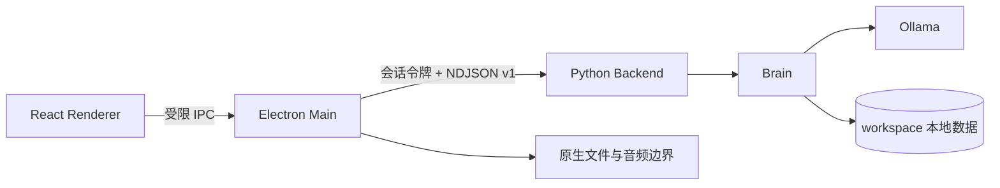

<p align="center">
  
</p>

<h1 align="center">Elysia AI</h1>

<p align="center">
  <a href="./README.en.md">English</a> | <strong>中文</strong>
</p>

<p align="center">
  <a href="https://github.com/ActorF/Elysia_AI/actions/workflows/tests.yml"></a>
</p>

**Elysia AI 是一个以爱莉希雅为角色核心、面向 Windows 的本地优先 AI 伴侣。**

> Python Core 负责 Chat、Project、Memory、恢复与本地 Ollama 推理，<br>
> React + Electron 桌面端通过经过认证、版本化的本地协议连接 Python，<br>
> 在保留角色化交流的同时，把用户数据、硬件权限和文件访问限制在清晰边界内。

> [!IMPORTANT]
>
> 本项目目前是 **开发预览**，不是下载即用的正式发行版。桌面壳仍依赖源码目录中的 Python 环境、Ollama 和本地模型；有界单句 STT 已接通，但其可选 Runtime 与模型不随基础安装提供。TTS、连续语音、RAG、Work Agent、Live2D 与正式安装体验尚未完成。

---

## ✨ 速览

- 💬 **本地文字聊天** — 使用 Ollama 本地模型生成流式回复，完整对话轮次原子保存
- 🗂️ **多 Chat 历史** — 支持创建、打开、重命名、置顶、归档、恢复、删除、停止生成与重试
- 📁 **Project 工作空间** — 支持 Instructions、Workspace 绑定、归档以及 Chat 的归属与移动
- 🧠 **分范围记忆** — 为 Global、Project、Chat 提供独立边界，并保留长期记忆、摘要与人工确认流程
- 🛡️ **严格桌面边界** — Renderer 沙箱、受限 Preload、来源校验与认证 NDJSON Protocol v1
- 📎 **安全附件表面** — Chat 与 Project 文件可选择、拖放、预览、移除和恢复；文件内容尚不解析或索引
- 🎙️ **本地单句转写** — 显式采集经过本地 VAD 与 Faster-Whisper，最终文字可编辑后放入 Chat 草稿
- 💾 **恢复优先** — 本地 JSON 存储、旧会话迁移、损坏隔离、原子写入以及导入/导出服务
- ♿ **桌面可用性** — 主题、键盘导航、焦点管理、Windows 缩放、中文 IME 与离线/错误恢复

---

## 📊 当前状态

| 能力 | 状态 | 当前边界 |
| --- | :---: | --- |
| 本地文字 Chat | ✅ 可用 | Ollama 流式回复、原子保存、停止与重试 |
| Chat History | ✅ 可用 | 多会话、置顶、归档、恢复、删除与独立草稿 |
| Project | ✅ 可用 | 元数据、Instructions、Workspace 绑定和 Chat 归属 |
| Memory Core | ✅ 可用 | Global / Project / Chat Scope、检索、摘要与长期记忆基础 |
| Settings | ✅ 可用 | Chat 模型、Ollama Origin、Memory/文件限额、主题，以及 STT 模型、设备和默认语言 |
| Attachments / Sources | ✅ 基础可用 | 仅安全存储与元数据；尚不读取、解析、Embedding 或 RAG |
| Audio Devices | ✅ 可用 | 麦克风/扬声器选择、Windows 权限、输入电平与输出音调测试 |
| 单句录音与本地 VAD | ✅ 可用 | 显式启动、16 kHz mono `s16le`、临时处理；不会自动生成 Chat Turn |
| STT / Faster-Whisper | ✅ 基础可用 | Electron/React 与本地 Final Transcript 已接通；需另装可选依赖并放置本地模型 |
| GPT-SoVITS / TTS | ⏳ 计划中 | 本地权重尚未接入运行时代码 |
| 连续语音与打断 | ⏳ 计划中 | 尚无完整 `LISTENING → THINKING → SPEAKING` 会话 |
| 文件解析与本地 RAG | ⏳ 计划中 | 尚无 Loader、Chunking、Vector Store 或引用回答 |
| Work Agent 与工具权限 | ⏳ 计划中 | 尚无工具执行、桌面控制、Internet 或 Vision 工作流 |
| Live2D / 桌宠 | ⏳ 计划中 | 当前只有桌面应用 UI 与占位角色区域 |
| 独立安装与更新 | ⏳ 计划中 | 当前打包结果不内置 Python、Ollama 或模型，也未签名 |

`✅ 可用` 表示核心流程已经实现；`🚧 开发中` 表示代码已进入集成或验收，但不应视为稳定能力；`⏳ 计划中` 表示当前界面或路线中可能已有入口，底层服务仍未完成。

---

## 🧭 架构与边界



- **Python 是业务事实来源**：Chat、Project、Memory、附件状态和持久化由 Python Domain/Service/Repository 管理。
- **Electron 是可信桌面边界**：它拥有 Python 子进程、原生文件选择、硬件权限与窗口生命周期。
- **React 保持沙箱化**：`contextIsolation: true`、`nodeIntegration: false`、`sandbox: true`；Renderer 不能直接读取 Node、Python、Chat、Memory 或本地源路径。
- **协议双端校验**：TypeScript 与 Python 使用同一组 JSON Schema/fixture 约束，连接前完成版本、能力与随机会话令牌握手。
- **本地数据可恢复**：关键 JSON 使用严格 Schema、revision、原子替换和损坏隔离；生成取消不会保存残缺的正式回复。
- **副作用必须显式**：打开 Voice 页面不会请求麦克风，选择附件不会自动读取内容，Project 的 Workspace 绑定也不会自动执行工具。

更多实现细节见 [Desktop 开发指南](./desktop/README.md)、[Protocol v1](./desktop_protocol/README.md) 与 [Electron Shell 决策记录](./docs/decisions/0001-desktop-shell.md)。

---

## 🚀 快速开始

### 前置条件

- **Windows 10 / 11 64 位**（主要开发与测试平台）
- **Python 3.14**
- **Node.js 24** 与 npm
- **[Ollama](https://ollama.com/)**
- Git

> [!NOTE]
>
> 以下命令均为 **CMD / Command Prompt** 写法，不需要修改 PowerShell Execution Policy。

### 1. 克隆仓库

```bat
git clone https://github.com/ActorF/Elysia_AI.git
cd /d Elysia_AI
```

### 2. 创建 Python 环境

```bat
py -3.14 -m venv .venv
.venv\Scripts\python.exe -m pip install --upgrade pip
.venv\Scripts\python.exe -m pip install -r requirements.txt
```

如需本地语音转写，再安装独立的可选依赖：

```bat
.venv\Scripts\python.exe -m pip install -r requirements-stt.txt
```

把完整的 Faster-Whisper 模型目录放在
`models\weights\faster-whisper\<model>\`；默认 `<model>` 是 `small`。
可选名称为 `tiny`、`base`、`small`、`medium`、`large-v3`、`turbo`。
Elysia 只打开所选本地目录，不会自动下载模型，模型权重也不得提交到 Git。

### 3. 准备本地模型

默认模型是 `qwen3.5:9b`：

```bat
ollama pull qwen3.5:9b
```

启动桌面端前，请确认 Ollama 正在运行，并且 `http://localhost:11434` 可访问。模型权重由 Ollama 本地管理，不随本仓库提供。

### 4. 安装桌面依赖

```bat
cd desktop
npm ci
cd ..
```

### 5. 启动桌面端

桌面开发模式需要两个 CMD 窗口。

第一个窗口启动 Vite Renderer：

```bat
cd /d D:\Elysia_AI\desktop
npm run dev
```

第二个窗口启动 Electron：

```bat
cd /d D:\Elysia_AI\desktop
npm run electron:dev
```

Electron 会从 Project Root 推导 `.venv\Scripts\python.exe` 与 `desktop_backend.py`，退出应用时也会清理该子进程。若仓库不在 `D:\Elysia_AI`，只需把上面两个启动命令中的工作目录替换成你的实际位置。

### 可选：启动 Console

```bat
cd /d D:\Elysia_AI
.venv\Scripts\python.exe start.py
```

Console 与 Electron Desktop 是两个入口，不需要同时启动。

---

## ⚙️ 配置

根目录 `.env` 是可选的。本项目在未创建 `.env` 时也有安全默认值：

```dotenv
MODEL_NAME=qwen3.5:9b
OLLAMA_HOST=http://localhost:11434
SHORT_TERM_MEMORY_TOKEN_BUDGET=2048
MEMORY_RETRIEVAL_LIMIT=5
DATA_IMPORT_MAX_BYTES=16777216
TRANSCRIPTION_MODEL=small
TRANSCRIPTION_DEVICE=auto
TRANSCRIPTION_LANGUAGE=auto
LOG_LEVEL=INFO
DEBUG=False
```

桌面端 **Settings** 允许修改 Chat 模型、Ollama Origin、Memory 限额、文件导入大小，以及本地转写模型、设备和默认语言；这些公开设置使用独立 revision 并写入 `workspace/settings/global.json`。转写模型可选 `tiny` / `base` / `small` / `medium` / `large-v3` / `turbo`，设备可选 `auto` / `cuda` / `cpu`，语言可选 `auto` / `zh` / `en`。Backend 重启后才会采用这些修改；主题则保存在当前设备的 Renderer Storage 中并立即生效。

本项目当前只连接本地 Ollama，不要求云端 API Key。不要把未来的密钥、Token 或私人配置提交到仓库。

---

## 🔍 功能说明

### 💬 Chat 与消息可靠性

- Assistant 回复使用安全 GFM 渲染，User 消息保持纯文本。
- 支持代码块、复制、流式状态、停止生成、Regenerate 与 Edit and retry。
- 草稿按 Chat 保存在本机；Renderer 刷新后可恢复草稿，并可重新附着到 Electron 持有的进行中请求。
- Chat 与 Project 的状态变更经过 Python 服务写入，Renderer 不自行生成持久化 ID 或直接修改索引。

### 📁 Project 与附件

- Project 可保存名称、Instructions、可选模型、Workspace 绑定和归档状态。
- Chat 可以在 Project 与未分配区域之间移动。
- 文件选择与拖放路径只在可信 Preload/Electron 边界处理；React 只看到 opaque ID、安全文件名、媒体类型和大小。
- 当前 Sources/Attachments 只负责本地安全存储与生命周期，不会读取文件内容，也不会自动发送给 RAG。

### 🧠 Memory 与恢复

- Memory 支持 Global、Project、Chat 三种 Scope，并按当前 Chat 的允许范围检索。
- Core 已包含 Profile、近期对话、长期记忆、摘要、候选记忆确认、搜索、编辑、删除和导出基础。
- Python 已有 Chat、Project 与全量用户数据的导入/导出、Legacy Conversation 迁移和损坏隔离服务；对应桌面管理 UI 尚未完成。

### 🎙️ Voice

- 已实现麦克风/扬声器枚举、设备偏好、Windows 麦克风权限状态、短暂输入电平与输出音调测试。
- 有界单句采集只在用户点击 **Start microphone** 后开始；Renderer 本地 downmix、重采样并运行本地 VAD。
- 有效片段固定为 16 kHz、mono、signed 16-bit little-endian PCM；同一份 PCM 只提交一次并保持临时，最终协议结果不含音频、模型路径或 Native Error。
- Electron/React 已把 `voice.transcription.start` 接到 Voice 页面。Faster-Whisper 返回有界 Final Transcript 后，用户可以先编辑，再显式选择 **Use transcript in message**；若 Chat 已有草稿，则使用 **Append transcript to message**，原草稿会保留在前。该操作只更新草稿，不会自动发送消息或创建 Chat Turn。
- 当前只返回最终文字；实时 Partial Transcript 明确留给后续持续语音会话。TTS、自动回复和 `LISTENING → THINKING → SPEAKING` 循环尚未完成。
- Settings 与 Voice 页面只显示经过枚举净化的就绪状态。缺模型、缺可选依赖、CUDA 不可用或初始化失败时会给出可操作步骤，不显示本地路径、底层异常或 Native 诊断；`auto` 可以选择安全的 CPU 回退。
- 已完成一次真实 CPU Runtime/模型的本地转写 Smoke 验证；CUDA 成功路径尚未在本文声称为实机验证。自动化测试同时覆盖 Fake Runtime、Cancel、Timeout、Native Draining 和迟到结果丢弃。
- 本机可选的 GPT-SoVITS 权重仍未接入。来源和使用限制见 [MODEL_LICENSE.md](./MODEL_LICENSE.md)。

---

## 🧪 开发与验证

### Python

```bat
cd /d D:\Elysia_AI
.venv\Scripts\python.exe scripts\check_python_documentation.py
.venv\Scripts\python.exe -m pytest -q
.venv\Scripts\python.exe -m mypy agent attachments chats config core desktop_protocol memory models projects recovery scripts tools ui voice desktop_backend.py start.py
```

### Desktop

```bat
cd /d D:\Elysia_AI\desktop
npm run docs:check
npm run lint
npm run typecheck
npm run test:contract
npm run test:ui
npm run build
npm audit --audit-level=high
```

`npm test` 会依次执行共享协议测试和 Electron Renderer UI 测试。GitHub Actions 在 Ubuntu 上运行 Python 与 Desktop 检查，并额外在 Windows 上运行原生附件桥接测试。

### 本地打包烟雾测试

```bat
cd /d D:\Elysia_AI\desktop
npm run package
```

输出位于 `desktop\out\win-unpacked`。`npm run make` 可以生成未签名的 NSIS Installer，但当前产物不包含 Python、Ollama 或模型，不能视为独立发行版。

---

## 🧱 技术栈

| 层级 | 技术 |
| --- | --- |
| AI Runtime | Ollama + `langchain-ollama` |
| Python Core | Python 3.14、typed domain/service/repository boundaries |
| Desktop Runtime | Node.js 24 + Electron 43 |
| Renderer | React 19 + TypeScript 6 + Vite 8 |
| Local Protocol | authenticated NDJSON Protocol v1 + JSON Schema |
| Persistence | revisioned/atomic local JSON under `workspace/` |
| Python Quality | AST 文档覆盖检查 + pytest 9 + mypy 2 |
| Desktop Quality | 源码文档覆盖检查 + ESLint 10 + Playwright 1.62 + TypeScript compiler |
| Packaging | electron-builder + unsigned NSIS development artifact |

---

## 📦 项目结构

```text
Elysia_AI/
├── attachments/        # Chat / Project 范围的本地附件存储边界
├── chats/              # Chat Domain、序列化、Repository 与迁移
├── config/             # 环境默认值与可持久化桌面设置
├── core/               # Brain、Ollama Adapter、Prompt 与 Active Conversation
├── data/characters/    # 角色参考语料；不属于源码许可范围
├── desktop/
│   ├── electron/       # Electron Main、Preload、Protocol 与原生边界
│   ├── src/            # React Renderer
│   └── tests/          # Protocol 与真实 Electron UI 测试
├── desktop_protocol/   # Python/TypeScript 共用的 Schema、Fixture 与校验器
├── memory/             # Profile、Summary、Long-term Memory 与 Scope
├── models/             # Python namespace；本地模型权重目录被 Git 忽略
├── projects/           # Project Domain、Repository 与 Chat 关系服务
├── recovery/           # 导入、导出、迁移与损坏隔离
├── tests/              # Python 测试
├── voice/              # 音频设备、PCM 校验、本地 STT Adapter 与有界任务
├── workspace/          # 运行时用户数据，被 Git 忽略；清理源码时不要删除
├── desktop_backend.py  # Electron ↔ Python 进程入口
└── start.py            # Console 入口与服务组合根
```

`logs/`、`.env`、`.venv/`、`workspace/`、Ollama blobs/manifests 与 `models/weights/` 都被 Git 忽略。

---

## ❓ FAQ

### 为什么在 CMD 中执行 `cd D:\Elysia_AI\desktop` 后仍停在 `C:\Windows\System32`？

CMD 的 `cd` 默认不会切换盘符。请使用：

```bat
cd /d D:\Elysia_AI\desktop
```

### PowerShell 提示 `npm.ps1 cannot be loaded` 怎么办？

直接使用 CMD 执行本文的 `npm` 命令即可，不需要为了本项目放宽系统的 PowerShell Execution Policy。

### 为什么桌面端显示 `Connection error` 或一直等待 Backend？

请确认：

1. Vite 与 Electron 分别在两个 CMD 窗口运行。
2. `.venv\Scripts\python.exe` 存在且依赖已安装。
3. Ollama 正在运行，Settings 中的 Origin 可访问。
4. 配置的模型已经通过 `ollama pull <model>` 安装。
5. `logs\app.log` 与 Electron 终端中没有新的启动错误。

### 为什么 Voice 页面显示本地转写不可用？

先用 `requirements-stt.txt` 安装可选 Runtime，把所选模型的完整本地目录放到 `models\weights\faster-whisper\<model>\`，再到 **Settings → Speech recognition** 选择模型、`auto` / `cuda` / `cpu` 设备和 `auto` / `zh` / `en` 语言，保存并重启 Backend。Voice 页面会显示安全的具体恢复提示。Final Transcript 仍不会自动回复或创建 Chat Turn；请先检查/编辑，再显式放入 Composer 并发送。

### 为什么 Project Sources 不能回答文件内容？

目前文件只被安全地保存并显示元数据，Loader、Chunking、Embedding、Vector Store、Retriever 与引用回答仍在后续计划中。

---

## 🔐 本地数据与隐私

- Chat、Project、Memory、Attachments、Settings 与迁移状态保存在 `workspace/`。
- `workspace/` 和 `logs/` 不进入 Git；请把它们视为私人数据，也不要随调试包公开。
- `.env` 被 Git 忽略，但仍不应放入不受信任的同步目录。
- 文件源路径不会返回给 React；附件公开状态只包含最小安全元数据。
- 音频测试不会保存录音。有界采集的 PCM 只在校验或转写所需的短暂生命周期内存在，不进入 Chat 或 Memory；协议结果不包含 PCM、模型路径或 Native Error。
- 删除源码或构建产物时不要误删 `workspace/`；需要迁移数据时应使用 Recovery Service 生成的受校验导出。

---

## ⚠️ 模型、角色与素材说明

本地 Faster-Whisper 模型、GPT-SoVITS 权重、参考音频、Ollama 模型和缓存不属于 Elysia AI 源码；当前 Git Index 与打包文件清单不包含这些文件。详细来源、限制与待核验事项见 [MODEL_LICENSE.md](./MODEL_LICENSE.md)。

尤其需要注意：本地模型包的说明没有提供可核验的完整再分发授权，因此不得把权重或参考音频提交到本仓库、上传到 Release，或打进安装包。

`data/characters/elysia_character_reference_zh.md` 已被 Git 跟踪，其中语录与语音转写尚未完成逐条来源和授权审查。这是当前仓库的分发风险，不应等到正式发行时才处理；详情与建议动作同样记录在 [MODEL_LICENSE.md](./MODEL_LICENSE.md)。

项目所有者明确选择把《崩坏3》爱莉希雅官方刻印作为本非官方、非商业粉丝项目的公开品牌素材。PNG/ICO 不属于项目源码许可，相关权利仍归 HoYoverse / miHoYo；本项目不声称获得官方背书，并会响应权利人的移除要求。

---

## ⚖️ 免责声明与许可证状态

Elysia AI 是非官方粉丝开发项目，与 HoYoverse / miHoYo **没有隶属、合作、赞助或背书关系**。《崩坏3》、爱莉希雅以及相关角色、剧情、美术、声音、表演、名称与商标的权利归各自权利人所有。本项目不会也不能授予这些第三方内容的权利。

请根据所在地区与具体用途查阅最新的 [HoYoverse Fan-made Content 帮助说明](https://support.hoyoverse.com/hc/en-us/articles/51005649400729-What-are-the-guidelines-for-creating-and-selling-fan-made-content) 和 [《Honkai Impact 3rd》素材与同人创作指南](https://www.hoyolab.com/article/1463874)。后者明确说明其适用范围不包含中国大陆简体中文版，不能把它当作所有地区的统一授权。

本仓库目前 **没有根级源代码 `LICENSE` 文件**。因此，仓库可见或可克隆不代表已获得复制、修改、再分发或商用源代码的通用许可。若项目所有者之后选择软件许可证，应单独添加正式 `LICENSE`，并明确排除角色 IP、角色语料、模型权重、参考音频以及其他第三方资产。

本节与 [MODEL_LICENSE.md](./MODEL_LICENSE.md) 只是事实与边界说明，不构成法律意见，也不替代权利人的许可。

---

## 🙏 致谢

- **爱莉希雅 /《崩坏3》**：© HoYoverse / miHoYo
- **本地 Elysia GPT-SoVITS v2 模型包**：模型发布标注为 `TinyLight微光小明`，整合包提供者标注为 `花儿不哭`
- **角色配音表演**：本地模型说明标注 CV 为宴宁；相关声音与表演权利不属于本项目
- **GPT-SoVITS**：[RVC-Boss/GPT-SoVITS](https://github.com/RVC-Boss/GPT-SoVITS)
- **核心工具链**：Ollama、Python、Electron、React、TypeScript、Vite、Playwright、pytest 与 mypy

如来源、署名或权利说明存在错误，请通过 GitHub Issue 或仓库维护渠道提出更正；在事实核实前，相关资产应继续保持本地、非分发状态。

---

## 💌 参与项目

欢迎提交与代码、测试、文档和可访问性有关的 Issue 或 Pull Request。源码注释要求见 [`AGENTS.md`](./AGENTS.md)，新增或修改源码必须通过其中的文档覆盖检查。请勿提交模型权重、游戏语音、运行时用户数据、日志、`.env`，或未记录来源、权利人规则和维护者决定的第三方素材。
