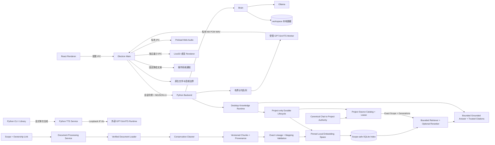

<p align="center">
  
</p>

<h1 align="center">Elysia AI</h1>

<p align="center">
  <a href="./README.en.md">English</a> | <strong>中文</strong>
</p>

<p align="center">
  <a href="https://github.com/ActorF/Elysia_AI/actions/workflows/tests.yml"></a>
</p>

**Elysia AI 是一个以爱莉希雅为角色核心、面向 Windows 的本地优先 AI 伴侣。**

> Python Core 负责 Chat、Project、Memory、恢复与本地 Ollama 推理，<br>
> React + Electron 桌面端通过经过认证、版本化的本地协议连接 Python，<br>
> 在保留角色化交流的同时，把用户数据、硬件权限和文件访问限制在清晰边界内。

> [!IMPORTANT]
>
> 本项目目前是 **开发预览**，不是下载即用的正式发行版。桌面壳仍依赖源码目录中的 Python 环境、Ollama 和本地模型；Project Sources 管理、本地文件问答与可信引用、有界单句 STT、显式确认的 Voice Session、受管 GPT-SoVITS 分句播放、思考/朗读期间的安全 Barge-in，以及正常回复后的可选自动续听已经接通。文件问答必须由用户在 Project Chat 中明确开启；自动续听默认关闭、在通话页可见且可随时关闭，每轮 Final Transcript 仍需人工检查并明确发送。封闭的 Character State API 把 Chat、Voice 与 Knowledge 生命周期映射到主界面和 Voice 的审核静态半身素材；这两个界面不会创建 Live2D、WebGL 或动态嘴型。独立透明置顶桌宠默认关闭，只有用户选择本机外部 Live2D 目录、选择扫描到的兼容模型并明确开启后，才会以可拖动的全身动态模型运行。外部模型不进入 Git、GitHub、安装包或构建输出。用户限定的 `neutral / happy / sad` 选择 TTS 参考与静态角色表情，模型不能下发任意情绪、路径或动画指令。固定文案的系统通知继续默认关闭。通知允许独立开启回复完成提示，并可另选 Daily / Weekly 中性提醒，也可一键全部关闭。提醒的调度与投递只在 Elysia 已运行时发生，不建立后台服务、开机自启、连续打卡或模型生成的主动消息。可选语音 Runtime、模型和参考音频均不随基础安装提供，实时 Partial Transcript、Work Agent 与正式安装体验尚未完成。真实麦克风/扬声器、房间回声和长通话人工矩阵未执行，项目负责人已明确豁免其作为当前交付的关闭门槛，因此本项目不声称这些人工观察已经通过。

---

## ✨ 速览

- 💬 **本地文字聊天** — 使用 Ollama 本地模型生成流式回复，完整对话轮次原子保存
- 🗂️ **多 Chat 历史** — 支持创建、打开、重命名、置顶、归档、恢复、删除、停止生成与重试
- 📁 **Project 工作空间** — 支持 Instructions、Workspace 绑定、归档以及 Chat 的归属与移动
- 🧠 **分范围记忆** — 为 Global、Project、Chat 提供独立边界，并保留长期记忆、摘要与人工确认流程
- 🛡️ **严格桌面边界** — Renderer 沙箱、受限 Preload、来源校验与认证 NDJSON Protocol v1
- 📎 **Project Sources 与本地文件问答** — Project 文件可添加、替换、重新索引、导出、撤销和删除，并可向前恢复中断的持久操作；生产 Python Runtime 有界加载、清洗、分块、索引和检索，从 canonical Chat→Project 关系授权共享 Sources，经固定本地 Ollama Adapter 生成结构化回答，并在桌面 Chat 中持久显示可信 Citation
- 🎙️ **本地 Voice Session** — 显式采集经过本地 VAD 与 Faster-Whisper；Final Transcript 可编辑，发送后可在思考或朗读期间自然打断
- 🔊 **本地回复朗读** — Python 按自然断句排队调用受管 GPT-SoVITS，Electron 在可信 Preload 中按序播放经过双重校验的 PCM WAV
- 🎭 **角色状态 API** — 将 Chat、Voice 与 Knowledge 生命周期归一为封闭语义状态，并为未来 Work/Approval 保留闭集；角色组件不直接操作动画文件
- 🌸 **应用内静态角色** — 主界面与 Voice 使用审核半身素材呈现七种语义状态和用户限定情绪，始终静态且不依赖 Live2D
- 🌷 **可选动态桌宠** — 默认关闭；Settings 扫描用户选择的本机 Live2D 目录并列出兼容模型，选定后在独立透明置顶窗口中动态显示
- 🔕 **可选 Presence 与系统通知** — 回复完成通知和 Daily / Weekly 中性提醒均默认关闭、静音且可完全停用；固定文案不包含对话、Project 或文件内容
- 💾 **恢复优先** — 本地 JSON 存储、旧会话迁移、损坏隔离、原子写入以及导入/导出服务
- ♿ **桌面可用性** — 主题、键盘导航、焦点管理、Windows 缩放、中文 IME 与离线/错误恢复

---

## 📊 当前状态

| 能力 | 状态 | 当前边界 |
| --- | :---: | --- |
| 本地文字 Chat | ✅ 可用 | Ollama 流式回复、原子保存、停止与重试 |
| Chat History | ✅ 可用 | 多会话、置顶、归档、恢复、删除与独立草稿 |
| Project | ✅ 可用 | 元数据、Instructions、Workspace 绑定和 Chat 归属 |
| Memory Core | ✅ 可用 | Global / Project / Chat Scope、检索、摘要与长期记忆基础 |
| Settings | ✅ 可用 | Chat/Ollama/Memory/文件/STT、主题、外部桌宠模型选择，以及自动朗读、语速、音量、Voice Profile、`neutral / happy / sad` Voice Emotion、字幕、人工 Transcript 审核和自动续听 |
| Attachments / Sources | ✅ 可用 | Scope-bound 文件存储与 Project Sources UI；生命周期写操作支持进度、受限协作取消和显式恢复；已验证原始文件导出共用全局 Knowledge 租约，但不进入操作日志、也没有 Renderer Stop |
| Audio Devices | ✅ 可用 | 麦克风/扬声器选择、Windows 权限、输入电平与输出音调测试 |
| 单句录音与本地 VAD | ✅ 可用 | 显式启动、16 kHz mono `s16le`、临时处理；不会自动生成 Chat Turn |
| STT / Faster-Whisper | ✅ 基础可用 | Electron/React 与本地 Final Transcript 已接通；需另装可选依赖并放置本地模型 |
| 有界 Voice Session | ✅ 可用 | `IDLE → LISTENING → TRANSCRIBING → THINKING → SPEAKING → IDLE`；绑定准确 Chat/Project，Final Transcript 必须人工确认 |
| GPT-SoVITS / TTS | ✅ 基础可用 | Chat 串流分句、受管本机 Worker、有界队列、私有 fd3 传输与 Electron 播放已接通；需本机 Runtime、Profile、权重和参考音频 |
| Barge-in / 语音打断 | ✅ 可用 | 仅在显式发送的 Voice Turn 回复期间启用；要求经过验证的 WebRTC 回声消除与持续语音确认，并精确取消该 Turn |
| 自动续听 | ✅ 可用 | 可见开关可在正常回复安全结束后再次监听；默认关闭，Final Transcript 不会自动发送 |
| Character State API | ✅ 可用 | 封闭的 `idle / listening / thinking / speaking / working / waiting_approval / error` 合同；Chat、Voice 与 Knowledge 已接入，审批状态保留给后续真实 Work/Approval 流程 |
| 应用内角色 | ✅ 可用 | 主界面与 Voice 固定使用审核静态半身素材，由七种语义状态和三种用户限定表情选择；不初始化 Live2D、WebGL 或音频驱动嘴型 |
| Live2D 桌宠 | ✅ 可用 | 默认 `disabled`；用户选择本机目录后，Settings 按实际扫描结果列出兼容模型，`visible` 动态显示选中模型，`hidden` 保留选择但销毁独立 Renderer；加载或运行失败会关闭桌宠窗口并进入可重试状态 |
| Presence 与系统通知 | ✅ 可用 | 回复完成通知默认 Off；中性提醒只允许 Off / Daily / Weekly，前台、Voice 或忙碌时不弹出且不补发；无云推送、后台服务、行为追踪或模型生成通知 |
| 文件解析与本地 RAG | ✅ 基础可用 | 版本化 Chunk Lineage、固定本地 Embedding 空间、Scope-safe SQLite 索引、有界 Retriever/Reranker、loopback-only Grounded Generator、同 Project 多 Chat 共享且跨 Project fail-closed；Chat 需显式开启 **Use Project Sources**，证据不足不会生成无引用回答 |
| Work Agent 与工具权限 | ⏳ 计划中 | 尚无工具执行、桌面控制、Internet 或 Vision 工作流 |
| 外部 Live2D 支持 | ✅ 可用 | 仅用于可选桌宠；模型由用户持有并从本机目录直接读取，不复制进仓库、安装包或应用数据 |
| 独立安装与更新 | ⏳ 计划中 | 当前打包结果不内置 Python、Ollama 或模型，也未签名 |

`✅ 可用` 表示核心流程已经实现；`🚧 开发中` 表示代码已进入集成或验收，但不应视为稳定能力；`⏳ 计划中` 表示当前界面或路线中可能已有入口，底层服务仍未完成。

---

## 🧭 架构与边界


```mermaid
flowchart LR
    R[React Renderer] -->|受限 IPC| E[Electron Main]
    E -->|会话令牌 + NDJSON v1| P[Python Backend]
    P --> B[Brain]
    B --> O[Ollama]
    B --> D[(workspace 本地数据)]
    P --> Q[有界分句队列]
    Q --> M[受管 GPT-SoVITS Worker]
    M -->|私有 fd3 PCM WAV| E
    E -->|私有 IPC| W[Preload Web Audio]
    E -->|独立最小 IPC| DP[Live2D 桌宠 Renderer]
    E -->|固定静音文案| NO[操作系统通知]
    C[Python CLI / Library] -. 显式单次合成 .-> T[Python TTS Service]
    T -->|Loopback IP /tts| G[外部 GPT-SoVITS Runtime]
    E --> H[原生文件与音频边界]
    P --> DK[Desktop Knowledge Runtime]
    A[Scope + Ownership Link] --> S[Document Processing Service]
    S --> L[Verified Document Loader]
    L --> N[Conservative Cleaner]
    N --> K[Versioned Chunks + Provenance]
    K --> V[Exact Lineage + Mapping Validation]
    V --> X[Pinned Local Embedding Space]
    X --> Z[(Scope-safe SQLite Index)]
    Z --> Y[Bounded Retriever + Optional Reranker]
    Y --> J[Bounded Grounded Answer + Trusted Citations]
    U[Canonical Chat to Project Authority] --> RAG[Project Source Catalog + Lease]
    KL[Project-only Durable Lifecycle] --> RAG
    KL --> X
    RAG -->|Exact Scope + Generations| Y
    DK --> KL
    DK --> J
```

- **Python 是业务事实来源**：Chat、Project、Memory、附件状态和持久化由 Python Domain/Service/Repository 管理。
- **Electron 是可信桌面边界**：它拥有 Python 子进程、原生文件选择、硬件权限与窗口生命周期。
- **React 保持沙箱化**：`contextIsolation: true`、`nodeIntegration: false`、`sandbox: true`；Renderer 不能直接读取 Node、Python、Chat、Memory 或本地源路径。
- **桌宠能力独立且默认关闭**：没有保存偏好或旧版偏好迁移时，Main 保持 `disabled`。用户必须在 Settings 选择外部模型目录、从实际扫描到的兼容模型中选择一套并明确设为 `visible`；`hidden` 保留选择但销毁窗口。Main 独占原生目录路径、资源清单、偏好、窗口和显示器坐标；主 Renderer 只看到不含原生路径的模型摘要及不透明选中 ID。桌宠 Renderer 使用隔离 Session 和最小 Preload，只能报告就绪或失败、隐藏自己、打开主 Chat，以及获取当前模型的 generation-scoped 不透明 Bootstrap。模型资源只通过 generation-scoped 精确白名单协议读取；它不能访问 Backend、任意网络、文件系统、任意 IPC 或主 Renderer API。损坏的偏好 Fail Closed 到 `disabled`，缺失或不兼容的模型库则阻止进入 `visible` 并返回净化后的可恢复状态。
- **Presence 与通知默认全关**：Main 独占严格、revisioned 的设备偏好、计时器和原生通知对象；Renderer 不能提交标题、正文、链接、声音、Urgency 或任意计划。回复完成只观察经过最终一致性验证的 `chat-complete`，提醒按 24 小时或 7 天从明确选择时重新计时；到期周期会先保存处理锚点，再仅在窗口不存在、隐藏或最小化且 Backend 空闲时投递。窗口仍可见，或 Chat、Voice、完整受管朗读生命周期（包括合成空档和最终播放排空）、Knowledge 忙碌时只消费该周期；退出会停止计时器与投递，不会伪造新的已处理周期。
- **协议双端校验**：TypeScript 与 Python 使用同一组 JSON Schema/fixture 约束，连接前完成版本、能力与随机会话令牌握手。
- **本地数据可恢复**：关键 JSON 使用严格 Schema、revision、原子替换和损坏隔离；生成取消不会保存残缺的正式回复。
- **文档派生、授权、检索与回答保持可验证**：生产 Python Pipeline 从无路径 `LoadedDocument` 生成版本化 Chunk，复核 Piece-table、Fingerprint/Lineage 与 Source Mapping，再把精确 Chunk Lineage 绑定到固定本地 Embedding 空间和 Scope-safe SQLite 索引。Project-only Knowledge Lifecycle 用路径私有 journal 协调 add/replace/reindex/rebuild/revoke/delete：新 Generation 最后发布 catalog，破坏性操作先 tombstone 再清理。`ProjectSourceAnswerService` 只从 canonical Chat→Project 关系、原子 ownership snapshot 与显式 catalog 派生准确 Generation；Retriever 只搜索该闭集。`GroundedAnswerService` 再选择完整命中的有界前缀，把问题、片段与 style guidance 作为不可信 JSON Data 交给固定 digest、loopback-only 的同步结构化 Generator，并只发布能解析到可信 Evidence 的陈述与 Citation。Assistant 文本和 proof 原子保存，桌面可展开安全来源与页/块/单元格定位；结构闭包仍不能证明模型概括或推断在语义上必然正确。
- **副作用必须显式**：打开 Voice 页面不会请求麦克风；首次采集必须由用户主动开始。用户发送审核后的 Transcript 后，程序才可在该回复期间监听打断；只有用户明确开启可见的自动续听开关，正常完成的回复才会开始下一次有界采集，而且识别结果仍不会自动发送。选择附件不会自动读取内容，Project 的 Workspace 绑定也不会自动执行工具。

更多实现细节见 [Desktop 开发指南](./desktop/README.md)、[Protocol v1](./desktop_protocol/README.md)、[Document Cleaning and Chunking](./docs/06-DOCUMENT-CLEANING-CHUNKING.md)、[Local Embeddings and Vector Store](./docs/07-LOCAL-EMBEDDINGS-VECTOR-STORE.md)、[Retriever and Reranking](./docs/08-RETRIEVER-RERANKING.md)、[Grounded Answers and Citations](./docs/09-GROUNDED-ANSWERS-CITATIONS.md)、[Project Sources](./docs/10-PROJECT-SOURCES.md)、[Knowledge Lifecycle](./docs/11-KNOWLEDGE-LIFECYCLE.md)、[Knowledge UI and Testing](./docs/12-KNOWLEDGE-UI-TESTING.md)、[Live2D Runtime](./docs/14-LIVE2D-RUNTIME.md) 与 [Electron Shell 决策记录](./docs/decisions/0001-desktop-shell.md)。

---

## 🚀 快速开始

### 前置条件

- **Windows 10 / 11 64 位**（主要开发与测试平台）
- **Python 3.14**
- **Node.js 24** 与 npm
- **[Ollama](https://ollama.com/)**
- Git

> [!NOTE]
>
> 以下命令均为 **CMD / Command Prompt** 写法，不需要修改 PowerShell Execution Policy。

### 1. 克隆仓库

```bat
git clone https://github.com/ActorF/Elysia_AI.git
cd /d Elysia_AI
```

### 2. 创建 Python 环境

```bat
py -3.14 -m venv .venv
.venv\Scripts\python.exe -m pip install --upgrade pip
.venv\Scripts\python.exe -m pip install -r requirements.txt
```

如需本地语音转写，再安装独立的可选依赖：

```bat
.venv\Scripts\python.exe -m pip install -r requirements-stt.txt
```

把完整的 Faster-Whisper 模型目录放在
`models\weights\faster-whisper\<model>\`；默认 `<model>` 是 `small`。
可选名称为 `tiny`、`base`、`small`、`medium`、`large-v3`、`turbo`。
Elysia 只打开所选本地目录，不会自动下载模型，模型权重也不得提交到 Git。

如需测试本地语音合成，请另行准备你有权使用的 GPT-SoVITS Runtime、Checkpoint 和参考音频。把 `config\voice_profiles.example.json` 复制为被忽略的 `workspace\settings\voice-profiles.json`，再填写准确参考文本与语言，并把每个资产对象的 `path`、实际字节数 `bytes` 和 64 位小写 `sha256` 全部替换为真实值；示例中的长度和 Hash 只是占位符，不能用于真实资产。Catalog 只接受严格的 Schema v2，不会回退读取旧版字符串路径。资产路径在 Windows 上也使用 `/`，权重和参考音频只能位于被忽略的 `models\weights\gpt-sovits\` 下。读取 Catalog 只验证声明格式，不代表文件或外部服务已受信；当前 Loopback HTTP Adapter 仍报告 `service_binding_unverified`。确认这些本机内容后，在 `.env` 设置 `GPT_SOVITS_ALLOW_LOCAL_EVALUATION=True`。基础安装不会下载或启动 GPT-SoVITS，也不会把这些素材提交或打包。

从旧版字符串路径手动迁移时，可在 CMD 中逐项取得精确长度和 SHA-256；命令不会修改文件。`certutil` 输出中的 `A-F` 写入 JSON 时需改为小写（若写进 `.bat`，把 `%I` 改成 `%%I`）：

```bat
for %I in ("models\weights\gpt-sovits\sample-voice\weights\sample.ckpt") do @echo bytes=%~zI
certutil -hashfile "models\weights\gpt-sovits\sample-voice\weights\sample.ckpt" SHA256
```

### 3. 准备本地模型

默认模型是 `qwen3.5:9b`：

```bat
ollama pull qwen3.5:9b
```

启动桌面端前，请确认 Ollama 正在运行，并且 `http://localhost:11434` 可访问。模型权重由 Ollama 本地管理，不随本仓库提供。

可选：只在单独开发或测试文档 Embedding/索引 Library 时，再显式安装已固定的 Embedding 模型；基础文字 Chat 不需要它，程序也不会自动下载：

```bat
ollama pull qwen3-embedding:0.6b
```

### 4. 安装桌面依赖

```bat
cd desktop
npm ci
cd ..
```

### 5. 启动桌面端

在一个 CMD 窗口中运行一次：

```bat
cd /d D:\Elysia_AI\desktop
npm run dev
```

该命令会先编译 Electron Main/Preload，再启动 Vite，并在 Renderer 就绪后启动 Electron。Electron 会从 Project Root 推导 `.venv\Scripts\python.exe` 与 `desktop_backend.py`，退出应用时也会清理该子进程。若仓库不在 `D:\Elysia_AI`，只需把工作目录替换成你的实际位置。

只检查 Renderer 页面时可运行 `npm run dev:renderer`。它是裸浏览器预览，不会注入 Electron Preload，因此不能连接 Python Backend、麦克风或 Desktop Pet；完整功能必须使用 `npm run dev` 打开的 Electron 窗口。

### 可选：启动 Console

```bat
cd /d D:\Elysia_AI
.venv\Scripts\python.exe start.py
```

Console 与 Electron Desktop 是两个入口，不需要同时启动。

---

## ⚙️ 配置

根目录 `.env` 是可选的。本项目在未创建 `.env` 时也有安全默认值：

```dotenv
MODEL_NAME=qwen3.5:9b
OLLAMA_HOST=http://localhost:11434
SHORT_TERM_MEMORY_TOKEN_BUDGET=2048
MEMORY_RETRIEVAL_LIMIT=5
DATA_IMPORT_MAX_BYTES=16777216
TRANSCRIPTION_MODEL=small
TRANSCRIPTION_DEVICE=cpu
TRANSCRIPTION_LANGUAGE=auto
GPT_SOVITS_ALLOW_LOCAL_EVALUATION=False
GPT_SOVITS_REQUEST_TIMEOUT_SECONDS=120
GPT_SOVITS_PROBE_TIMEOUT_SECONDS=1
GPT_SOVITS_DETERMINISTIC_SEED=42
LOG_LEVEL=INFO
DEBUG=False
```

桌面端 **Settings** 允许修改 Chat 模型、Ollama Origin、Memory 限额、文件导入大小，以及本地转写模型、设备和默认语言；这些公开设置使用独立 revision 并写入当前数据根下的 `workspace/settings/global.json`。转写模型可选 `tiny` / `base` / `small` / `medium` / `large-v3` / `turbo`，设备可选 `auto` / `cuda` / `cpu`，语言可选 `auto` / `zh` / `en`。默认使用 `cpu`，为同时驻留的 Ollama 与 GPT-SoVITS 保留 GPU 显存；只有在目标机器完成三组件资源基准后才建议显式改为 `auto` 或 `cuda`。

同一份全局设置还包含八个语音字段：自动朗读、50–200% 语速、0–100% 音量、受限的逻辑 Voice Profile ID、`neutral / happy / sad` Voice Emotion、字幕、Transcript 审核模式和自动续听。其中自动朗读、音量、字幕、只允许 `manual` 的审核模式以及自动续听共五项是 live preference；语速、Voice Profile 与 Voice Emotion 三项进入 `restartFields`，在 Backend 重启前保持 Saved/Active 分离。成功重启后，同一 Active Emotion 同时选择本地 TTS 参考与审核静态表情。其余模型、Ollama、Memory/文件限额与 STT Runtime 设置也继续遵守既有重启边界；主题保存在当前设备的 Renderer Storage 中并立即生效。

桌面应用不要求云端 API Key。文字 Chat 只连接本地 Ollama；可选桌面 TTS 由 Python Backend 从固定本机目录启动受管 GPT-SoVITS Worker，并经私有 fd3 把音频交给 Electron。独立的 Python Smoke CLI 仍可连接 Loopback GPT-SoVITS 进行诊断。`GPT_SOVITS_ALLOW_LOCAL_EVALUATION` 默认关闭；只有在你确认本地 Voice Profile 的权利与路径后才应显式开启。不要把未来的密钥、Token、私人 Prompt 或私人配置提交到仓库。

---

## 🔍 功能说明

### 💬 Chat 与消息可靠性

- Assistant 回复使用安全 GFM 渲染，User 消息保持纯文本。
- 支持代码块、复制、流式状态、停止生成、Regenerate 与 Edit and retry。
- 草稿按 Chat 保存在本机；Renderer 刷新后可恢复草稿，并可重新附着到 Electron 持有的进行中请求。
- Chat 与 Project 的状态变更经过 Python 服务写入，Renderer 不自行生成持久化 ID 或直接修改索引。

### 📁 Project 与附件

- Project 可保存名称、Instructions、可选模型、Workspace 绑定和归档状态。
- Chat 可以在 Project 与未分配区域之间移动。
- 文件选择与拖放路径只在可信 Preload/Electron 边界处理；React 只看到 opaque ID、安全文件名、媒体类型和大小。
- Sources/Attachments 负责本地安全存储；生产 Document Pipeline 只能通过 Scope-bound 验证读取生成带来源映射的 Chunk，再以版本化本地 Embedding 和精确 Project 过滤的 SQLite Store 建立索引。Project-only Knowledge Lifecycle 用持久 saga journal 安全协调 add/replace/reindex/rebuild/revoke/delete，新 Generation 最后授权、删除先撤销 catalog。原始文件导出共用全局 Knowledge operation coordinator，但不进入 saga journal；它使用身份固定的私有 cleanup intent 收敛崩溃遗留。用户选定目标且请求进入 Python 后，Electron 会跨 Renderer 刷新和 Project 切换继续持有该不可由 Renderer 取消的导出，并在路径私有的 receipt 与已认证 Source metadata 完全匹配后才发布关联终态；目标路径不会进入 React。Project Chat 明确开启 **Use Project Sources** 后，`ProjectSourceAnswerService` 从 canonical Chat→Project 关系派生准确 Allowlist；Retriever 只搜索该闭集，Grounded Answer 层固定拥有同一次检索与生成操作，空命中不调用模型，回答中的安全文件名、页码和 Block/Cell/Offset 都从可信 Evidence 构造。结构化回答与 Citation 随 Assistant Message 原子持久化并由 Renderer 安全显示。

### 🧠 Memory 与恢复

- Memory 支持 Global、Project、Chat 三种 Scope，并按当前 Chat 的允许范围检索。
- Core 已包含 Profile、近期对话、长期记忆、摘要、候选记忆确认、搜索、编辑、删除和导出基础。
- Python 已有 Chat、Project 与全量用户数据的导入/导出、Legacy Conversation 迁移和损坏隔离服务；对应桌面管理 UI 尚未完成。

### 🎙️ Voice

- 已实现麦克风/扬声器枚举、设备偏好、Windows 麦克风权限状态、短暂输入电平与输出音调测试。
- 有界单句采集只在用户点击 **Start microphone** 后开始；Renderer 本地 downmix、重采样并运行本地 VAD。
- 有效片段固定为 16 kHz、mono、signed 16-bit little-endian PCM；同一份 PCM 只提交一次并保持临时，最终协议结果不含音频、模型路径或 Native Error。
- Voice 页面使用封闭的五状态生命周期：`IDLE → LISTENING → TRANSCRIBING → THINKING → SPEAKING → IDLE`。Final Transcript 返回后仍停留在 `TRANSCRIBING`，允许用户检查和编辑；只有显式点击 **Send transcript** 才会进入 `THINKING`。
- **Send transcript** 复用与文字 Composer 相同的可靠 Chat 发送路径，不存在第二套 Voice Brain。用户消息、Brain 串流回复、Chat 持久化、Summary 与 Scoped Memory 都属于打开 Voice 时绑定的准确 Chat 和可选 Project；文字与语音可以在同一 Chat History 中交替使用。
- **Use transcript in message** / **Append transcript to message** 仍是只写入草稿、不发送的替代操作。直接发送 Transcript 不会消费已有 Composer 草稿，也不会把暂存附件附加到语音消息。
- 播放开始后 Session 进入 `SPEAKING`。文字终态与播放终态可以任意先后到达，只有两侧都结束后才回到 `IDLE`；若 `voice.speech` 不可用或运行中失效，文字回复仍正常完成，不会因等待可选语音而卡住。
- 用户显式发送审核后的 Transcript 后，回复处于 `THINKING` 或 `SPEAKING` 时会启动专用 Barge-in 监听。它要求 WebRTC `echoCancellation: { exact: true }`，并验证实际 Track Settings；无法确认回声消除时会 Fail Closed、释放麦克风并让当前回复安全继续，不信任未经验证的回声路径。已验证的 AEC 用于降低 Elysia 扬声器输出造成自身打断的风险；本文不据此声称已通过真实麦克风/扬声器设备矩阵验收。
- Barge-in VAD 要求持续语音达到确认阈值。确认用户开口后，可信边界先停止本地播放，再以准确 `{requestId, chatId}` 取消该 Turn 的待处理/运行中 Speech，并以准确 Chat Request 请求停止 LLM Stream；重复、迟到或错误归属的取消不能影响其他 Turn。
- Session 绑定准确的 Chat ID、Project ID 和本地 epoch；Capture、STT、Chat Request 与 Speech Sequence 都必须匹配。接受打断会递增 Epoch，并把已确认的新采集接入新的 `LISTENING`；旧轮次迟到事件以及关闭 Voice、切换 Chat/Project 或导航后的跨上下文事件都会被拒绝。
- Chat 继续使用原有事务 Commit Gate：取消在 Commit 前胜出时，不会保存残缺的 Assistant Message；若完整提交已先胜出，则保留完整文字并只停止仍属于该 Turn 的播放。若新一轮 PCM 已完成但旧 Chat 仍未终止，它只在内存中等待最多 10 秒；超时、挂断、上下文切换和其他隐私边界会覆盖并丢弃该缓冲区，不会发送或保存。
- Voice UI 会分别显示 Listening、Transcribing、Thinking、Speaking、Monitoring、Interrupting、Cancelled 与 Error 状态，并提供计时、字幕、静音、挂断和音频设备入口。当前 STT 仍只返回 Final Transcript，没有实时 Partial Transcript 或自动提交；普通采集、打断后的新采集以及自动续听得到的 Transcript 都必须由用户检查并明确发送。
- 自动续听默认关闭，并同时受 Settings 默认值和通话页可见开关控制。开启后，只有 Chat 正常完成且预期的朗读也安全结束，程序才会开始下一次有界采集；静音、挂断、关闭 Voice、切换 Chat/Project、关闭该开关、能力或设备不可用，以及失败或取消终态都会暂停或退出循环。
- Settings 与 Voice 页面只显示经过枚举净化的就绪状态。缺模型、缺可选依赖、CUDA 不可用或初始化失败时会给出可操作步骤，不显示本地路径、底层异常或 Native 诊断；`auto` 可以选择安全的 CPU 回退。
- 已完成一次真实 CPU Runtime/模型的本地转写 Smoke 验证；CUDA 成功路径尚未在本文声称为实机验证。自动化测试同时覆盖 Fake Runtime、Cancel、Timeout、Native Draining 和迟到结果丢弃。
- 2026-09-23 的三组件实机基准让 `qwen3.5:9b` 与受管 GPT-SoVITS 并行使用 RTX 4070 SUPER，并在两者驻留时用 CPU Faster-Whisper 转写；观察到全局峰值 9,824 / 12,282 MiB。完整测量、清理证据、限制与重测条件见 [Voice Performance, Safety, and Rights Acceptance](./docs/03-VOICE-PERFORMANCE-SAFETY-RIGHTS.md)。
- Python 已提供引擎无关的合成 Contract、本地 Voice Profile Catalog、惰性 Composition Root 和只接受 Loopback IP Origin 的 GPT-SoVITS `/tts` Adapter；`localhost` 会先规范化为 `127.0.0.1`。通用 Contract 对最大 32 MiB 的 PCM WAV、Ogg Opus 与受支持 ADTS AAC 子集执行完整 Container/Transport Framing 检查，不冒充 Codec 解码；当前非流式 GPT-SoVITS Adapter 只配置 WAV/AAC，并要求有界、声明 `Content-Length`、非压缩且非 `Transfer-Encoding` 的响应。
- 本机真实验收使用同一固定中文测试句，对 `neutral`、`happy`、`sad` 各连续合成两次，六次均得到有效 WAV；停掉服务后 Smoke 返回稳定的 `service_unreachable`，完整文字 Chat 回归仍通过。`service_binding_unverified` 表示服务在线但上游 API 不能证明当前加载的是 Catalog 所声明的权重，不是对权重身份的背书。
- 桌面路径从 `Brain.stream_chat()` 复制准确文本块，在自然标点或长度上限处分句；有界 FIFO 只允许一个受管 Worker 合成。NDJSON 只承载关联 Metadata，PCM WAV 通过独立 fd3 进入 Electron Main，再由不属于公开 `DesktopApi` 的私有 IPC 送到 Preload Web Audio；每个片段会应用已保存的扬声器选择和当前音量，通过 GainNode 控制增益。指定设备不可用时跳过该片段，不会悄悄回退到其他扬声器；音量为 0 时只静音该片段，不会关闭合成。主界面与 Voice 的角色图保持静态，可信 Preload 不为它们建立音频分析器或发布嘴型提示。用户在 Settings 选择的 `neutral / happy / sad` 是唯一允许的 Voice Emotion；成功重启后，同一 Active 值选择 GPT-SoVITS 参考与有界静态表情，模型不能提交任意情绪、路径、参数、图集格或动画命令。React 只收到 Request/Chat、`playing|played|skipped` 加 Sequence 或 `completed|cancelled` 终态，不接触 WAV、Token、Hash、文本、准确 Prompt、诊断或本机资产路径；以准确 Request ID 与 Chat ID 停止播放也必须经过可信 Main 校验。Profile 配置、Runtime、权重和参考音频均留在被 Git 忽略的本机目录；来源和使用限制见 [MODEL_LICENSE.md](./MODEL_LICENSE.md)。

### 🌷 可选 Live2D 桌宠

- 首次不存在桌宠偏好文件时使用 `disabled`，不会创建窗口或加载模型。Settings 的 `disabled / hidden / visible` 是完整闭集：`hidden` 保留用户选择但立即销毁桌宠 Renderer 释放其资源，`disabled` 完全关闭，只有已选择兼容模型时 `visible` 才创建窗口。
- 用户通过原生目录选择器指定外部 Live2D 合集；Scanner 按有界规则发现兼容 `model3.json`，按外观去重，并优先选择标准交互版本。Settings 显示实际检测数量和安全名称，不显示原生路径。项目所有者当前本机合集可检测六套外观；其他下载内容按实际扫描结果呈现，不硬编码“六套”。来源标注为 `@书呆儿`，记录的公开下载页为 <https://pan.quark.cn/s/cb5d84acad8e>，但链接当前内容和条款尚未独立核验。
- 主 Chat/Voice 永远使用静态半身素材；只有桌宠读取用户选中的外部 `.moc3`、多纹理与可选 `physics3`，以全身动态构图、Blink/Breath/Head 动态和模型自带物理显示。动作、表情、Pose 等引用会由 Main 有界验证，但当前 Renderer 不执行它们。WASM/WebGL/模型加载或运行失败会立即关闭失败的透明窗口，并在 Settings 提供重试状态。它不使用 `07-desktop-pet-key-poses.png`，也不是自主 Agent。
- Electron Main 只允许一个透明、无边框、置顶的桌宠窗口。全身角色区域本身就是拖动表面；悬浮或键盘聚焦时显示的控制条属于非拖动区，可打开主 Chat 或隐藏桌宠。名义尺寸为 320×480 DIP，并在显示器工作区较小时缩小；纯几何函数按当前多显示器 DIP 工作区恢复和钳制位置，不把 `scaleFactor` 重复乘入坐标。显示器移除、分辨率或缩放变化后会重新钳制，Settings 和托盘均可重置位置。
- 控制条的 Chat 按钮显示并聚焦主窗口、进入主 Chat；Hide 按钮切换到 `hidden`。托盘可显示/隐藏、禁用、重试失败窗口，以及临时开启鼠标穿透；Settings 在失败状态也提供显式重试。鼠标穿透不会持久化；选择 Hidden 后即使主窗口已关闭，进程和托盘仍会保留为恢复入口，只有 Off 才恢复“最后窗口关闭即退出”的行为。
- 桌宠使用自己的 HTML 入口、隔离 Session、Sandbox 和最小 Preload。其公开 API 精确限制为 `ready / failed / hide / openMainChat / getModelBootstrap`；无参数 `failed` 只允许桌宠让 Main 立即收敛失败窗口，不携带错误正文或路径。它没有 Backend、Chat 数据、任意网络、文件系统、Storage、Node、原始 IPC、语音或主 Renderer 能力。模型 Bootstrap 只含不透明模型 ID 和 generation-scoped Manifest URL；Manifest 引用的 MOC、纹理、动作、表情与物理文件只能经 Scanner 生成的精确资源白名单读取，目录遍历、符号链接、旧 generation、未知资源、Query/Fragment、导航、新窗口和权限请求均被拒绝。
- 偏好由 Main 保存在 Electron `userData` 下的独立严格 JSON 中，采用 16 KiB 读取上限、revision CAS 和同目录临时文件同步后原子替换；本机目录路径、资源路径和显示位置只保留在 Main，公开状态只含不透明选中 ID 与净化后的模型摘要。Settings、托盘、桌宠控制、位置重置与拖动保存共用一条变更队列，显示器 ID、坐标和路径从不返回 Renderer。缺失文件与旧版迁移均默认 `disabled`；存在但损坏、超限或不合法的文件也 Fail Closed 到 `disabled`。Preload 加载失败会立即销毁窗口；真实模型在 30 秒内未完成初始化并报告 ready 时才由超时门禁销毁，二者都进入净化后的 `failed` 状态。退出会先排空已接纳的偏好写入，再保存最终位置，整个可选持久化序列最多等待 2 秒。该失败可从 Settings 或托盘重试，不影响主 Chat、Voice 或 Backend。

### 🔕 Presence 与系统通知

- Settings 中的 **Reply completion notifications** 与 **Neutral presence reminders** 属于 Electron Main 本机偏好，不依赖 Python Backend 设置，也不要求重启。两项默认值分别为 Off 与 Off；提醒频率闭集只有 Off、Daily 和 Weekly，**Turn all off** 会用一次 revisioned 更新完整停用两项能力。
- 回复提示只在用户发起的 Chat 或 Retry 已通过完整流与最终回复一致性校验、主窗口不受注意且没有 Voice 页面、尚未排空的受管朗读或 Knowledge 工作时显示。取消、错误、流式片段、语音转写、Knowledge 进度都不会触发；通知正文固定为本地文案，绝不包含 Prompt、Reply、Chat/Project 名称、文件名、Memory 或模型输出。
- 中性提醒从启用或改频率时重新计算完整 24 小时 / 7 天间隔，只在 Elysia 已运行、主窗口不存在、隐藏或最小化、Backend Ready 且没有 Chat、Voice、尚未排空的受管朗读或 Knowledge 工作时显示。到期时若因窗口仍可见或这些活动仍忙而被抑制，该周期会安全记为已处理，不会在稍后隐藏窗口或恢复空闲后追补；退出期间不会运行提醒任务。通知固定静音、用固定 ID/Group 保持全局至多一个，点击只显示并聚焦 Elysia。
- 严格 16 KiB JSON 只保存选择、revision、更新时间和 Main 私有的最后处理周期；损坏文件 Fail Closed 到全部关闭。Renderer 的 Web Notification 权限仍被拒绝，公开 Preload 只允许读取、完整 CAS 更新、状态订阅和一个只用于抑制通知投递的 Voice-active 布尔值；没有任意 `notify(title, body)` 能力，也不注册后台任务、自启动、云推送、连续打卡或参与度追踪。

---

## 🧪 开发与验证

### Python

```bat
cd /d D:\Elysia_AI
.venv\Scripts\python.exe scripts\check_python_documentation.py
.venv\Scripts\python.exe scripts\check_distribution_assets.py
.venv\Scripts\python.exe -m pytest -q
.venv\Scripts\python.exe -m mypy --platform win32 agent attachments chats config core desktop_protocol documents knowledge_lifecycle memory models project_sources projects recovery scripts tools ui voice desktop_backend.py desktop_knowledge.py desktop_speech.py start.py
```

已单独启动 Loopback GPT-SoVITS 并完成本地 Profile 配置后，可用固定、不会回显参考文本或路径的 Smoke 命令验证单次合成；每个情绪会合成同一句话两次：

```bat
cd /d D:\Elysia_AI
.venv\Scripts\python.exe scripts\smoke_gpt_sovits.py --profile default --emotion neutral --emotion happy --emotion sad
```

成功输出只含 Readiness Code、格式、字节数、时长与 SHA-256；服务未启动时输出 `{"error":"service_unreachable"}` 并返回非零退出码。Smoke 不会把音频写入磁盘。当前本机被忽略的 v2 Runtime 可在另一个 CMD 窗口按其本地配置启动，并用 `Ctrl+C` 停止：

```bat
cd /d D:\Elysia_AI\models\cache\GPT-SoVITS-v2-240821
runtime\python.exe -X utf8 api_v2.py -c GPT_SoVITS\configs\tts_infer_elysia.yaml -a 127.0.0.1 -p 9880
```

该具体目录和 YAML 只是本机验收环境，不在仓库中；其他开发者应使用自己核验过的 Runtime 与 Profile，不能从这个命令推断模型素材可再分发。

在 Ollama、被忽略的 Faster-Whisper 模型、受管 GPT-SoVITS Runtime 与已经完成权利审查但仍只限本机评估的 Voice Profile 都准备好，并显式启用 `GPT_SOVITS_ALLOW_LOCAL_EVALUATION=True` 后，可以运行三组件多周期资源基准：

```bat
cd /d D:\Elysia_AI
.venv\Scripts\python.exe scripts\benchmark_voice_pipeline.py --cycles 3
```

基准会并发执行 Ollama Streaming 与受管 TTS，再在两者仍驻留时使用 CPU Faster-Whisper 转写内存中的合成 WAV。输出 JSON 只包含延迟、Ollama `/api/ps` 的模型显存值和 `nvidia-smi` 全局采样；不会保存或输出音频、测试文本、转写内容或本机路径。Windows WDDM 下进程级显存通常不可用，因此全局 GPU 峰值可能包含桌面和其他进程负载；运行前应关闭无关 GPU 工作，并在目标机器上重复足够周期。当前验收结果见 [完整记录](./docs/03-VOICE-PERFORMANCE-SAFETY-RIGHTS.md)。

### Desktop

```bat
cd /d D:\Elysia_AI\desktop
npm run docs:check
npm run lint
npm run typecheck
npm run test:contract
npm run test:ui
npm run build
npm audit --audit-level=high
```

`npm test` 会依次执行共享协议测试和 Electron Renderer UI 测试。GitHub Actions 在 Ubuntu 上运行 Python 与 Desktop 检查，并额外在 Windows 上运行原生附件桥接、文件守卫、不加载真实模型的受管 GPT-SoVITS 进程/Runtime 边界测试，以及真实 Unpacked Package + ASAR 分发审计；真实 Runtime/模型验收仍需在配置完整的本机执行。

### 本地打包烟雾测试

```bat
cd /d D:\Elysia_AI\desktop
npm run package
npx --no-install asar list out\win-unpacked\resources\app.asar > "%TEMP%\elysia-asar-listing.txt"
if exist "%TEMP%\elysia-asar-extracted" rmdir /s /q "%TEMP%\elysia-asar-extracted"
call "D:\Elysia_AI\desktop\node_modules\.bin\asar.cmd" extract "D:\Elysia_AI\desktop\out\win-unpacked\resources\app.asar" "%TEMP%\elysia-asar-extracted"
cd /d D:\Elysia_AI
.venv\Scripts\python.exe scripts\check_distribution_assets.py --unpacked-tree desktop\out\win-unpacked --asar-listing "%TEMP%\elysia-asar-listing.txt" --extracted-asar-tree "%TEMP%\elysia-asar-extracted"
```

输出位于 `desktop\out\win-unpacked`。审计会同时检查真实 Unpacked Tree、ASAR 清单与完整抽取树；PurismCore/许可证、应用图标及全部静态回退必须恰好出现一次且符合固定长度与 SHA-256，任何 Live2D manifest、MOC、physics、motion、expression 或编辑器模型文件都必须为零。Git 和安装包中的 PNG、ICO、WebP 等视觉素材还受准确路径白名单约束，因此把付费纹理改名为普通图片或移动到普通目录也会被拒绝。审计同样拒绝本机 AI 模型权重、音频、Runtime/User Data、压缩包、退役构建残留或链接逃逸；它必须在每次发布产物前运行。`npm run make` 可以生成未签名的 NSIS Installer，但当前产物不包含 Python、Ollama 或推理模型，不能视为独立发行版。

---

## 🧱 技术栈

| 层级 | 技术 |
| --- | --- |
| AI Runtime | Ollama + `langchain-ollama`；可选受管本机 GPT-SoVITS Worker 与独立 Loopback Adapter |
| Python Core | Python 3.14、typed domain/service/repository boundaries |
| Desktop Runtime | Node.js 24 + Electron 43 |
| Renderer | React 19 + TypeScript 6 + Vite 8 |
| Local Protocol | authenticated NDJSON Protocol v1 + JSON Schema |
| Persistence | 可移动的版本化数据根；原子 JSON、SQLite 索引与私有附件 Blob |
| Python Quality | AST 文档覆盖检查 + pytest 9 + mypy 2 |
| Desktop Quality | 源码文档覆盖检查 + ESLint 10 + Playwright 1.62 + TypeScript compiler |
| Packaging | electron-builder + unsigned NSIS development artifact |

---

## 📦 项目结构

```text
Elysia_AI/
├── attachments/        # Chat / Project 范围的本地附件存储边界
├── chats/              # Chat Domain、序列化、Repository 与迁移
├── config/             # 环境默认值、ProductionDataLayout 与桌面设置
├── core/               # Brain、Ollama Adapter、Prompt 与 Active Conversation
├── data/characters/    # 角色参考语料；不属于源码许可范围
├── desktop/
│   ├── electron/       # Electron Main、Preload、Protocol 与原生边界
│   ├── src/            # React Renderer
│   └── tests/          # Protocol 与真实 Electron UI 测试
├── desktop_protocol/   # Python/TypeScript 共用的 Schema、Fixture 与校验器
├── documents/          # Path-private 文档派生、索引、检索与 Grounded Answer/Citation
├── knowledge_lifecycle/ # Project-only 可恢复生命周期 saga 与已验证导出清理/恢复
├── memory/             # Profile、Summary、Long-term Memory 与 Scope
├── models/             # Python namespace；本地模型权重目录被 Git 忽略
├── projects/           # Project Domain、Repository 与 Chat 关系服务
├── project_sources/    # Chat-derived Project Source 授权、Catalog 与回答组合
├── recovery/           # 导入、导出、迁移与损坏隔离
├── tests/              # Python 测试
├── voice/              # 音频设备、PCM/STT、TTS Contract/Profile、分句队列与受管 Runtime
├── workspace/          # 仅 Console/旧开发布局；Desktop 首次运行会安全复制
├── desktop_backend.py  # Electron ↔ Python 进程入口
├── desktop_speech.py   # 桌面语音分句、受管合成与二进制交付协调器
└── start.py            # Console 入口与服务组合根
```

`logs/`、`.env`、`.venv/`、旧开发用 `workspace/`、Ollama blobs/manifests、`models/cache/` 与 `models/weights/` 都被 Git 忽略。Desktop 的正式数据根默认位于 Electron `userData/data`，可在 **Settings → Data & storage** 查看、移动、统计容量，并只清理应用自有的临时音频、Cache 与 Log；无法安全删除的旧副本会跨重启显示为 Recovery Copy，等待人工核对。精确布局和失败回滚规则见 [Production Data Layout](./docs/13-PRODUCTION-DATA-LAYOUT.md)。

---

## ❓ FAQ

### 为什么在 CMD 中执行 `cd D:\Elysia_AI\desktop` 后仍停在 `C:\Windows\System32`？

CMD 的 `cd` 默认不会切换盘符。请使用：

```bat
cd /d D:\Elysia_AI\desktop
```

### PowerShell 提示 `npm.ps1 cannot be loaded` 怎么办？

直接使用 CMD 执行本文的 `npm` 命令即可，不需要为了本项目放宽系统的 PowerShell Execution Policy。

### 为什么页面提示只能通过 Electron 打开，无法连接 Python Backend？

你打开的是 `npm run dev:renderer` 提供的裸浏览器预览，浏览器没有 Electron Preload，因此 Python Backend、麦克风和 Desktop Pet 都不会连接。关闭该预览，在 `desktop` 目录运行一次 `npm run dev`，并使用随后自动打开的 Electron 窗口。

### 为什么桌面端显示 `Connection error` 或一直等待 Backend？

请确认：

1. 已在 `desktop` 目录通过 `npm run dev` 启动 Electron，而不是只在浏览器中运行 `npm run dev:renderer`。
2. `.venv\Scripts\python.exe` 存在且依赖已安装。
3. Ollama 正在运行，Settings 中的 Origin 可访问。
4. 配置的模型已经通过 `ollama pull <model>` 安装。
5. **Settings → Data & storage** 所示目录内的 `logs\app.log` 与 Electron 终端中没有新的启动错误；Console 模式仍使用仓库内 `logs\app.log`。

### 为什么 Voice 页面显示本地转写不可用？

先用 `requirements-stt.txt` 安装可选 Runtime，把所选模型的完整本地目录放到 `models\weights\faster-whisper\<model>\`，再到 **Settings → Speech recognition** 选择模型、`auto` / `cuda` / `cpu` 设备和 `auto` / `zh` / `en` 语言，保存并重启 Backend。Voice 页面会显示安全的具体恢复提示。Final Transcript 永远不会在用户确认前发送；检查或编辑后，可以点击 **Send transcript**，让它通过当前 Chat 的正常发送、持久化、Memory 和回复链，也可以选择 **Use/Append transcript in message**，只把文字放入 Composer 后继续编辑。

### 为什么桌面端仍可能没有语音？

桌面回复朗读已经接通，但它是可选能力：必须存在完整本机 GPT-SoVITS Runtime、严格 Voice Profile、匹配 Hash 的权重与参考音频，并显式开启 `GPT_SOVITS_ALLOW_LOCAL_EVALUATION`。若单句合成、解码或播放失败，受影响句子会被跳过；只有无法安全继续的通道或生命周期故障才会停用语音，文字 Chat 始终继续工作。有界、人工确认的 Voice Session、回复期间 Barge-in 和正常回复后的可选自动续听均已接通；Barge-in 还要求浏览器能启用并证实 WebRTC Echo Cancellation，否则会安全关闭监听并继续回复。自动续听不会自动发送识别文本。实时 Partial Transcript 尚未完成；256 轮 Python STT、256 轮 Speech Queue 与 200 轮 Renderer Voice Soak 已证明程序内 Owner 会清空，但真实设备、房间回声和多小时人类通话矩阵未执行，并由项目负责人明确豁免为当前交付的关闭门槛，不代表这些人工观察已经通过。

### 如何让 Project Chat 回答文件内容？

先在 Project 页面用 **Add sources** 添加受支持文档，等待状态变为 **Ready**；然后打开属于该 Project 的 Chat，并明确开启 **Use Project Sources**。本地 Ollama 必须同时安装当前 Chat 模型和固定的 Embedding 模型。回答会区分来源事实、模型概括与推断，并显示可展开 Citation；如果当前 corpus 无充分证据，Elysia 会返回明确的 evidence-insufficient 状态，而不是生成无引用答案。`stale`、`revoked` 或 `recovery_required` 时请分别 Reindex/Rebuild 或 Recover。完整边界见 [Knowledge UI and Testing](./docs/12-KNOWLEDGE-UI-TESTING.md)。

---

## 🔐 本地数据与隐私

- Desktop 的 Chat、Project、Memory、Attachments、Sources、Knowledge 索引、Settings、恢复与迁移状态保存在 Main 选择的版本化数据根；Console 与旧开发模式在未注入独立根时仍兼容仓库内 `workspace/`。
- 正式数据根、旧 `workspace/` 和 `logs/` 都不进入 Git；请把它们视为私人数据，也不要随调试包公开。
- `.env` 被 Git 忽略，但仍不应放入不受信任的同步目录。
- 文件源路径不会返回给 React；附件公开状态只包含最小安全元数据。
- 音频测试不会保存录音。有界采集的 PCM 只在校验或转写所需的短暂生命周期内存在，不进入 Chat 或 Memory；协议结果不包含 PCM、模型路径或 Native Error。打断后的新 PCM 若需等待旧 Chat 终态，最多保留 10 秒，并会在超时、挂断、切换 Chat/Project、关闭 Voice 或其他隐私边界被覆盖和丢弃。
- 独立 TTS Adapter 只允许 Loopback 服务；Smoke 只输出 SHA-256 摘要和音频元数据，不保存合成音频。桌面受管路径不会使用 HTTP，且只把最小关联 Metadata 和经过校验的 WAV 送入 Electron；Voice Profile、准确参考文本、权重路径和参考音频不会进入 Desktop Protocol 或 React。当前局部 Manifest 只证明同一次启动所见文件一致，不是完整供应链证明，因此桌面缓存保持关闭，Runtime 与同一 Windows 用户在租约启动时仍属于信任范围。
- Elysia 的 Smoke 输出已经脱敏，但外部 GPT-SoVITS Runtime 自己的控制台或日志可能显示目标文本、参考文本与本地路径；这些上游日志也应视为私人本机数据，不要随调试包公开。
- 不要在清理源码时删除旧 `workspace/`。目录移动使用 Settings 中由 Main 独占的离线、校验和可回滚流程；它不是备份。现有 Recovery Service 导出只覆盖部分 Domain JSON，不能冒充完整数据根备份。

---

## ⚠️ 模型、角色与素材说明

本地 Faster-Whisper 模型、GPT-SoVITS 权重、参考音频、Ollama 模型和缓存不属于 Elysia AI 源码；当前 Git Index 与打包文件清单不包含这些文件。详细来源、限制与待核验事项见 [MODEL_LICENSE.md](./MODEL_LICENSE.md)。

尤其需要注意：本地模型包的说明没有提供可核验的完整再分发授权，因此不得把权重或参考音频提交到本仓库、上传到 Release，或打进安装包。

`data/characters/elysia_character_reference_zh.md` 已被 Git 跟踪，其中语录与语音转写尚未完成逐条来源和授权审查。这是当前仓库的分发风险，不应等到正式发行时才处理；详情与建议动作同样记录在 [MODEL_LICENSE.md](./MODEL_LICENSE.md)。

项目所有者明确选择把《崩坏3》爱莉希雅官方刻印作为本非官方、非商业粉丝项目的公开品牌素材。PNG/ICO 不属于项目源码许可，相关权利仍归 HoYoverse / miHoYo；本项目不声称获得官方背书，并会响应权利人的移除要求。

应用内的爱莉希雅立绘、七态图集、表情图集与嘴型审阅图集由 OpenAI 内置图像生成工具参考项目所有者提供的爱莉希雅图片生成。外部原始参考图片不进入仓库或安装包；已审核的旧立绘保留在仓库与安装包中，并作为图集的二次参考和故障回退。主界面和 Voice 只选择静态状态/表情素材，不使用嘴型审阅图集、不采样音频，也不执行 Live2D。全部审核 PNG 仍以准确路径、字节长度和 SHA-256 固定在分发门禁中，真实 ASAR 还必须恰好包含一次各路径并通过抽取字节复核。这些图片不属于源码许可，只用于本非官方、非商业粉丝项目；底层爱莉希雅与《崩坏3》角色 IP 仍归 HoYoverse / miHoYo 等适用权利人所有，不代表官方背书，并会响应有效的权利人移除要求。

可选动态桌宠使用用户本机持有的外部 Live2D 模型。当前本机六套合集来源标注为 `@书呆儿`，项目不会复制、提交、上传或打包其中任何模型文件；记录的免费版下载页为 <https://pan.quark.cn/s/cb5d84acad8e>，但其当前内容、授权和条款尚未独立核验。完整记录见 [MODEL_LICENSE.md](./MODEL_LICENSE.md)。

---

## ⚖️ 免责声明与许可证状态

Elysia AI 是非官方粉丝开发项目，与 HoYoverse / miHoYo **没有隶属、合作、赞助或背书关系**。《崩坏3》、爱莉希雅以及相关角色、剧情、美术、声音、表演、名称与商标的权利归各自权利人所有。本项目不会也不能授予这些第三方内容的权利。

2026-09-23 已重新核对 [HoYoverse Fan-made Content 帮助说明](https://support.hoyoverse.com/hc/en-us/articles/51005649400729-What-are-the-guidelines-for-creating-and-selling-fan-made-content)；它当前链接的特定产品同人指南，以及此前记录的[《Honkai Impact 3rd》素材与同人创作指南](https://www.hoyolab.com/article/1463874)，都不是本地声音模型、录音或表演权的再分发许可。具体授权缺口与处理决定见 [MODEL_LICENSE.md](./MODEL_LICENSE.md)。

本仓库目前 **没有根级源代码 `LICENSE` 文件**。因此，仓库可见或可克隆不代表已获得复制、修改、再分发或商用源代码的通用许可。若项目所有者之后选择软件许可证，应单独添加正式 `LICENSE`，并明确排除角色 IP、角色语料、模型权重、参考音频以及其他第三方资产。

本节与 [MODEL_LICENSE.md](./MODEL_LICENSE.md) 只是事实与边界说明，不构成法律意见，也不替代权利人的许可。

---

## 🙏 致谢

- **爱莉希雅 /《崩坏3》**：© HoYoverse / miHoYo
- **本地 Elysia GPT-SoVITS v2 模型包**：模型发布标注为 `TinyLight微光小明`，整合包提供者标注为 `花儿不哭`
- **角色配音表演**：本地模型说明标注 CV 为宴宁；相关声音与表演权利不属于本项目
- **GPT-SoVITS**：[RVC-Boss/GPT-SoVITS](https://github.com/RVC-Boss/GPT-SoVITS)
- **核心工具链**：Ollama、Python、pypdf、Electron、React、TypeScript、Vite、Playwright、pytest 与 mypy

如来源、署名或权利说明存在错误，请通过 GitHub Issue 或仓库维护渠道提出更正；在事实核实前，相关资产应继续保持本地、非分发状态。

---

## 💌 参与项目

欢迎提交与代码、测试、文档和可访问性有关的 Issue 或 Pull Request。源码注释要求见 [`AGENTS.md`](./AGENTS.md)，新增或修改源码必须通过其中的文档覆盖检查。请勿提交模型权重、游戏语音、运行时用户数据、日志、`.env`，或未记录来源、权利人规则和维护者决定的第三方素材。
